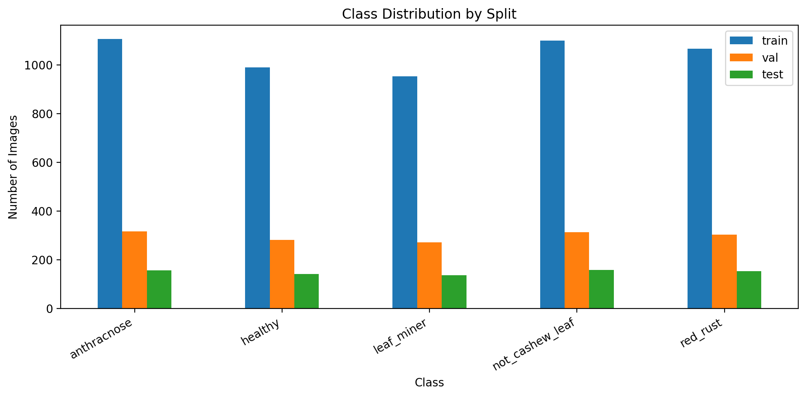
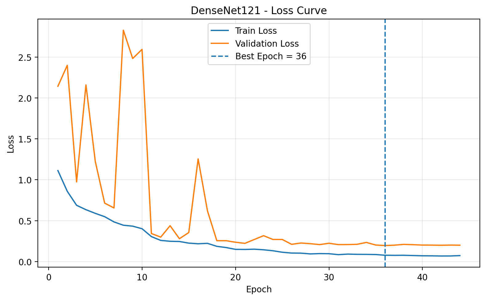
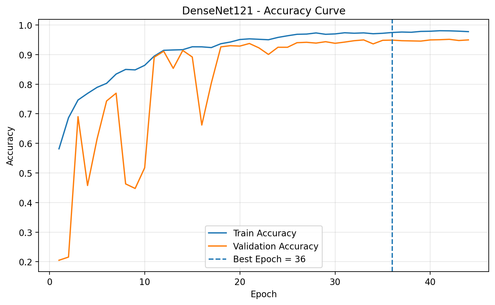
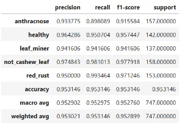
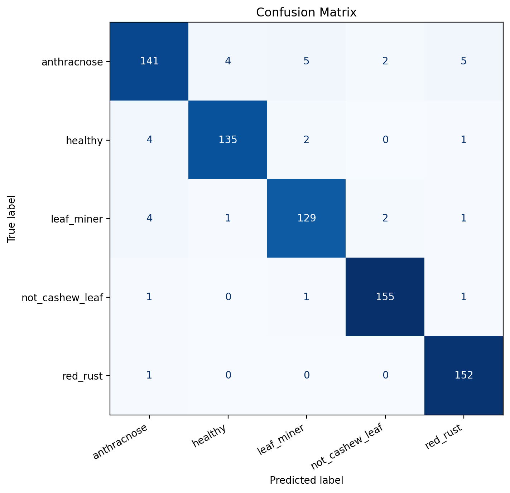
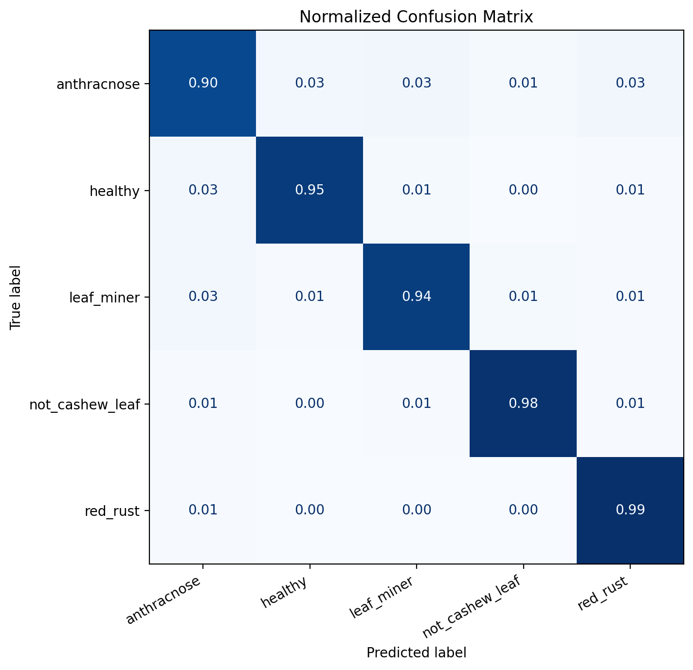

# 🧪 BÁO CÁO THỰC NGHIỆM: EXP-DENSENET121-SCRATCH-001

> **Mô hình:** DenseNet-121 (Huấn luyện từ đầu - Train from Scratch)  
> **Bộ dữ liệu:** `CashewData_v01` (7,450 ảnh / 5 lớp)  
> **Thời gian tạo:** 08/09/2026  
> **Độ chính xác kiểm thử (Test Accuracy):** **95.31%** | **Tốc độ suy luận (FPS):** **66.56**

---

## 📌 MỤC LỤC
1. [Tổng quan thực nghiệm](#1-tổng-quan-thực-nghiệm)
2. [Bộ dữ liệu & Phân chia mẫu](#2-bộ-dữ-liệu--phân-chia-mẫu)
3. [Kiến trúc mô hình & Thiết lập huấn luyện](#3-kiến-trúc-mô-hình--thiết-lập-huấn-luyện)
4. [Động lực học quá trình huấn luyện](#4-động-lực-học-quá-trình-huấn-luyện)
5. [Kết quả kiểm thử & Báo cáo phân loại](#5-kết-quả-kiểm-thử--báo-cáo-phân-loại)
6. [Phân tích ma trận nhầm lẫn & Giải thích bệnh học](#6-phân-tích-ma-trận-nhầm-lẫn--giải-thích-bệnh-học)
7. [Hiệu năng suy luận & Triển khai](#7-hiệu-năng-suy-luận--triển-khai)

---

## 1. TỔNG QUAN THỰC NGHIỆM

* **Mục tiêu:** Thiết lập baseline (đường chuẩn) thực nghiệm cho bài toán phân loại bệnh trên lá điều bằng kiến trúc DenseNet-121 huấn luyện hoàn toàn từ đầu (Random Initialization - Scratch), không dựa trên trọng số tiền huấn luyện ImageNet.
* **Môi trường thực thi:** Kaggle Notebook, 2 GPU song song (`MirroredStrategy`).
* **Tổng thời gian huấn luyện:** 3,358.40 giây (~55.97 phút) qua 44 epochs.

---

## 2. BỘ DỮ LIỆU & PHÂN CHIA MẪU

Tập dữ liệu `CashewData_v01` được chia theo phân tầng (Stratified Split) theo tỷ lệ 70 - 20 - 10:
* **Tập huấn luyện (Train):** 5,215 ảnh
* **Tập kiểm tra định kỳ (Validation):** 1,488 ảnh
* **Tập kiểm thử độc lập (Locked Test):** 747 ảnh
* **Tổng số ảnh:** 7,450 ảnh

  
   
  <em>Hình 1: Phân bố số lượng ảnh qua các tập Train/Val/Test cho 5 lớp đối tượng.</em>

---

## 3. KIẾN TRÚC MÔ HÌNH & THIẾT LẬP HUẤN LUYỆN

* **Backbone:** DenseNet121 (Gồm 4 Dense Blocks và 3 Transition Layers)
* **Phân loại đầu ra (Custom Head):**
  * `GlobalAveragePooling2D`
  * `Dense(512, activation='relu')`
  * `Dropout(rate=0.4)`
  * `Dense(5, activation='softmax')`
* **Tham số mô hình:**
  * Tổng tham số: **7,566,917**
  * Tham số huấn luyện (Trainable): **7,482,245**
  * Tham số đóng băng (Non-trainable): **84,672** (Batch Normalization moving mean/variance)
* **Cấu hình huấn luyện:**
  * Kích thước ảnh: $224 \times 224 \times 3$
  * Batch size: 32
  * Optimizer: Adam (Initial LR = 0.001)
  * Loss: Sparse Categorical Crossentropy
  * Callbacks:
    * `ModelCheckpoint`: Lưu model tốt nhất theo dõi `val_loss`.
    * `ReduceLROnPlateau`: factor=0.3, patience=3, min_lr=$10^{-6}$.
    * `EarlyStopping`: patience=8 epochs trên `val_loss`.

---

## 4. ĐỘNG LỰC HỌC QUÁ TRÌNH HUẤN LUYỆN

| Đường cong Hàm Mất Mát (Loss Curve) | Đường cong Độ Chính Xác (Accuracy Curve) |
| :---: | :---: |
|  |  |
| *Hình 2.1: Quá trình hội tụ của hàm mất mát (Train vs Val)* | *Hình 2.2: Quá trình cải thiện độ chính xác (Train vs Val)* |

### 🔎 Đánh giá động lực học:
* **Giai đoạn đầu (Epoch 1 - 16):** Xảy ra biến động lớn ở tập validation (loss vọt đỉnh ~2.82 ở epoch 8). Đây là đặc thù khi mạng nơ-ron sâu huấn luyện từ scratch tự tìm kiếm hướng gradient tối ưu mà chưa có feature representations sẵn.
* **Giai đoạn ổn định (Epoch 17 - 44):** Bộ lập lịch `ReduceLROnPlateau` hạ dần learning rate ($10^{-3} \to 3\times 10^{-4} \to 9\times 10^{-5} \to 2.7\times 10^{-5} \to 8.1\times 10^{-6} \to 2.43\times 10^{-6} \to 10^{-6}$), giúp đường cong validation loss và train loss hội tụ đều đặn và mượt mà.
* **Best Checkpoint:** Đạt tại **Epoch 36**:
  * **Best Val Loss:** `0.195691`
  * **Best Val Accuracy:** `94.89%`
* **Early Stopping:** Dừng ở epoch 44 sau khi `val_loss` không giảm thêm trong 8 epochs liên tiếp, bảo vệ mô hình khỏi hiện tượng quá khớp (overfitting).

---

## 5. KẾT QUẢ KIỂM THỬ & BÁO CÁO PHÂN LOẠI

Mô hình tốt nhất tại Epoch 36 được đánh giá trên tập **747 ảnh Test Set hoàn toàn độc lập**:

### 📊 Các chỉ số tổng quan (Overall Test Metrics):
| Chỉ số | Giá trị |
| :--- | :---: |
| **Test Loss** | **0.164014** |
| **Test Accuracy** | **95.3146%** (712/747 mẫu đúng) |
| **Macro Precision** | **95.2902%** |
| **Macro Recall** | **95.2975%** |
| **Macro F1-Score** | **95.2760%** |
| **Balanced Accuracy** | **95.2975%** |
| **Weighted F1-Score** | **95.2899%** |

### 📋 Bảng phân loại chi tiết từng lớp:
| Tên lớp | Precision | Recall | F1-Score | Support (Số ảnh Test) |
| :--- | :---: | :---: | :---: | :---: |
| **Anthracnose** | 0.9338 (93.38%) | 0.8981 (89.81%) | 0.9156 (91.56%) | 157 |
| **Healthy** | 0.9643 (96.43%) | 0.9507 (95.07%) | 0.9574 (95.74%) | 142 |
| **Leaf Miner** | 0.9416 (94.16%) | 0.9416 (94.16%) | 0.9416 (94.16%) | 137 |
| **Not Cashew Leaf** | 0.9748 (97.48%) | 0.9810 (98.10%) | 0.9779 (97.79%) | 158 |
| **Red Rust** | 0.9500 (95.00%) | **0.9935 (99.35%)** | 0.9712 (97.12%) | 153 |

  
   
  <em>Hình 3: Trực quan hóa báo cáo phân loại (Classification Report) trên tập Test.</em>

---

## 6. PHÂN TÍCH MA TRẬN NHẦM LẪN & GIẢI THÍCH BỆNH HỌC

| Ma trận Nhầm lẫn Tuyệt đối (Counts) | Ma trận Nhầm lẫn Chuẩn hóa (Normalized) |
| :---: | :---: |
|  |  |
| *Hình 4.1: Ma trận đếm số lượng dự đoán trên từng lớp* | *Hình 4.2: Tỷ lệ nhận diện chính xác chuẩn hóa (Recall) theo từng lớp* |

### 🔬 Phân tích thị giác máy tính & bệnh học:
1. **Bệnh Rỉ Sắt Đỏ (`red_rust` - Recall 99.35%):**
   * Đạt kết quả xuất sắc nhất với **152/153 mẫu** được phân loại chính xác, chỉ 1 mẫu nhầm sang anthracnose.
   * *Giải thích:* Bào tử tảo *Cephaleuros virescens* có sắc thái đỏ cam / nhung vàng rỉ sắt rất đặc trưng, tạo độ tương phản mạnh trên nền lá xanh, giúp các bộ lọc tích chập dễ dàng nhận diện.
2. **Lớp Ngoại Lai (`not_cashew_leaf` - Recall 98.10%, Precision 97.48%):**
   * Đạt **155/158 mẫu** chính xác.
   * *Giải thích:* Mô hình phân biệt rõ biên dạng hình học và hệ gân lá điều với các đối tượng ngoại lai (cỏ dại, lá cây khác, đất đá), đảm bảo độ tin cậy thực tế.
3. **Lá Khỏe Mạnh (`healthy` - Recall 95.07%, Precision 96.43%):**
   * **135/142 mẫu** chính xác.
   * *Giải thích:* 4 mẫu nhầm sang anthracnose do các vết sẹo gió hoặc đốm cháy vi lượng nhẹ trên phiến lá ngoài tự nhiên.
4. **Sâu Vẽ Bùa (`leaf_miner` - Recall 94.16%, Precision 94.16%):**
   * **129/137 mẫu** chính xác.
   * *Giải thích:* Đặc trưng đường hầm ngoằn ngoèo màu trắng xám được mô hình nắm bắt tốt. Một số mẫu nhầm sang thán thư khi mô lá dọc đường đục đã bị hoại tử khô chuyển màu nâu sẫm.
5. **Bệnh Thán Thư (`anthracnose` - Recall 89.81%, Precision 93.38%):**
   * **141/157 mẫu** chính xác (nhầm lẫn 5 mẫu sang leaf_miner, 5 sang red_rust, 4 sang healthy, 2 sang not_cashew_leaf).
   * *Giải thích:* Biểu hiện thán thư thay đổi đa dạng theo vòng đời bệnh: giai đoạn đốm non nhỏ dễ nhầm với chấm rỉ sắt non hoặc đốm sẹo sinh lý; giai đoạn cháy lá rộng có màu khô tương đồng tổn thương sâu vẽ bùa hoại tử.

---

## 7. HIỆU NĂNG SUY LUẬN & TRIỂN KHAI

* **Dung lượng mô hình lưu trữ:** **87.68 MB** (tệp `.keras` / `.h5`)
* **Thời gian suy luận trung bình:** **15.02 ms / ảnh**
* **Tốc độ xử lý khung hình:** **66.56 FPS**
* **Khả năng triển khai:** Tốc độ 66.56 FPS hoàn toàn đáp ứng các ứng dụng thời gian thực (Real-time Vision) trên thiết bị biên hoặc tích hợp camera giám sát vườn điều.
