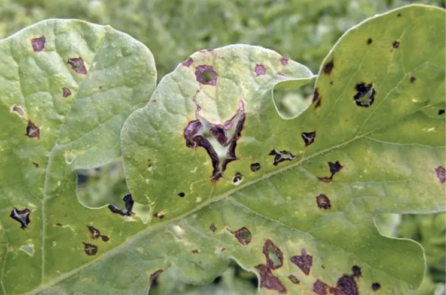
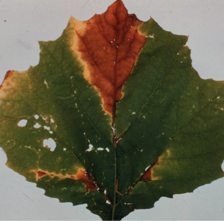
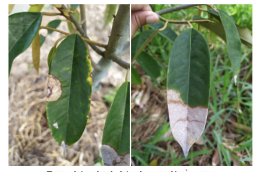
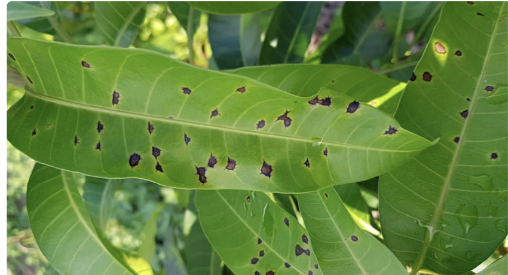
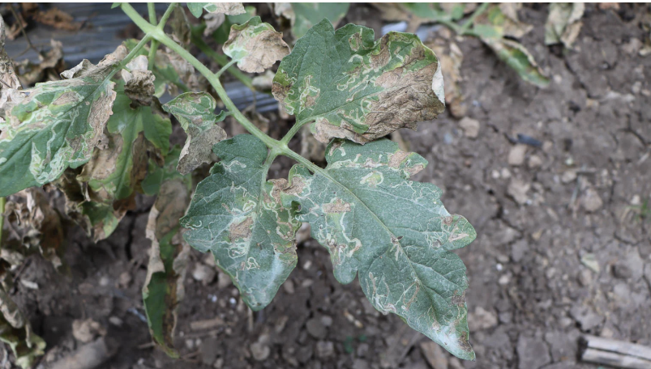
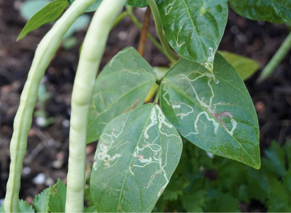
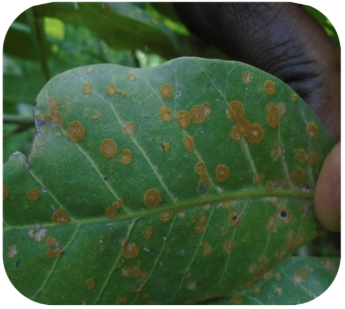
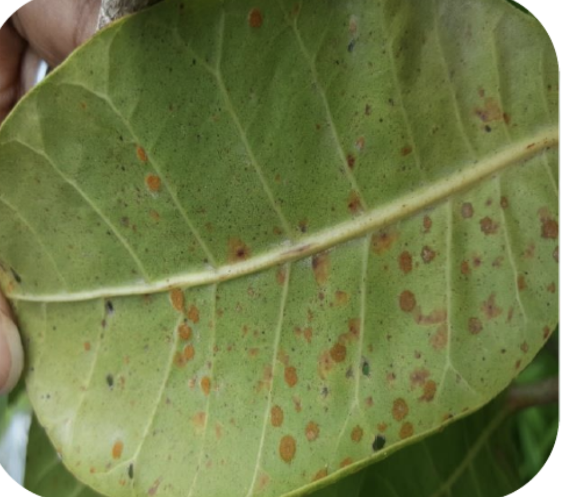
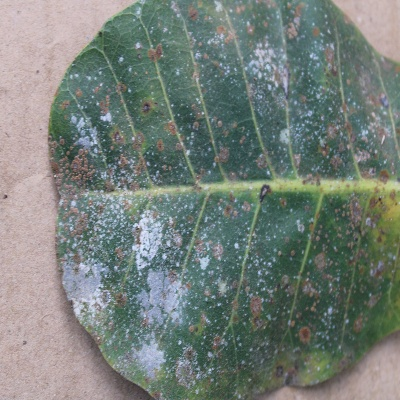

# 🍃 BẢN THAM KHẢO & NHẬN DIỆN CÁC LOẠI BỆNH TRÊN LÁ ĐIỀU
> **Tài liệu tham khảo chuyên sâu phục vụ nghiên cứu Khóa Luận Tốt Nghiệp: Phân loại bệnh trên lá điều (*Cashew Leaf Disease Classification*)**  
> 🔬 **Báo cáo thực nghiệm:** Xem chi tiết kết quả mô hình DenseNet-121 Scratch tại [EXP-DENSENET121-SCRATCH-001](./EXP-DENSENET121-SCRATCH-001/README.md).

---

## 📌 MỤC LỤC
1. [Tổng quan hệ thống bệnh hại lá điều](#-tổng-quan-hệ-thống-bệnh-hại-lá-điều)
2. [Bệnh Thán Thư (Anthracnose)](#1-bệnh-thán-thư-anthracnose)
3. [Bệnh Sâu Vẽ Bùa / Ruồi Đục Lá (Leaf Miner)](#2-bệnh-sâu-vẽ-bùa--ruồi-đục-lá-leaf-miner)
4. [Bệnh Rỉ Sắt Đỏ / Tảo Đỏ (Red Rust)](#3-bệnh-rỉ-sắt-đỏ--tảo-đỏ-red-rust)
5. [Bảng Ma Trận So Sánh & Chẩn Đoán Phân Biệt](#-bảng-ma-trận-so-sánh--chẩn-đoán-phân-biệt)
6. [Ý Nghĩa Nhận Diện Trong Thị Giác Máy Tính (Computer Vision)](#-ý-nghĩa-nhận-diện-trong-thị-giác-máy-tính-computer-vision)
7. [Tài Liệu Tham Khảo (References)](#-tài-liệu-tham-khảo-references)

---

## 🌿 TỔNG QUAN HỆ THỐNG BỆNH HẠI LÁ ĐIỀU

Cây điều (*Anacardium occidentale*) là một trong những cây công nghiệp có giá trị kinh tế xuất khẩu cao. Tuy nhiên, năng suất và sức sống của vườn điều thường xuyên bị đe dọa bởi các tác nhân gây bệnh hại lá. Việc nhận diện sớm và chính xác các loại tổn thương trên phiến lá là cơ sở tối quan trọng để xây dựng các mô hình thị giác máy tính hỗ trợ nông nghiệp chính xác.

Bản tài liệu này tổng hợp đặc điểm hình thái học, cơ chế phát sinh và hình ảnh thực địa mẫu của 3 loại tổn thương phổ biến nhất:
- **Anthracnose (Bệnh thán thư)** do nấm *Colletotrichum gloeosporioides*.
- **Leaf Miner (Sâu vẽ bùa / Ruồi đục lá)** do côn trùng gây hại (*Acrocercops syngramma* / sâu bướm, ruồi đục lá).
- **Red Rust (Bệnh rỉ sắt đỏ / Bệnh tảo đỏ)** do tảo ký sinh *Cephaleuros virescens*.

---

## 1. BỆNH THÁN THƯ (ANTHRACNOSE)

* **Tác nhân chính:** Nấm *Colletotrichum gloeosporioides* (Penz.) Penz. & Sacc.
* **Đối tượng mẫn cảm:** Cơi đọt non, lá non mới bung, hoa và chùm quả non.

### 🔍 Triệu chứng & Đặc điểm nhận diện
* **Khởi phát đốm nhỏ ở mép hoặc chóp lá:**
  * Bệnh thường bắt đầu tấn công từ mép lá hoặc chóp lá (đặc biệt mẫn cảm ở các cơi đọt non, lá còn mỏng).
  * Biểu hiện ban đầu dưới dạng các đốm tròn nhỏ, hơi lõm xuống, có màu nâu nhạt đến nâu đậm.
* **Vết cháy xém lớn và các vòng đồng tâm:**
  * Vết bệnh nhanh chóng lan rộng vào bên trong phiến lá, liên kết lại với nhau thành những mảng hoại tử khô xám hoặc màu nâu đen giống như bị lửa táp.
  * **Đặc điểm nhận diện điển hình nhất:** Sự xuất hiện của các **vòng tròn đồng tâm** hoặc đường vân gợn sóng nhô lên trên bề mặt vết bệnh.
  * Khi thời tiết ẩm ướt (mùa mưa, sương mù nhiều), vết bệnh sẽ tiết dịch nhầy dính hoặc mọc lên các khối chấm nhỏ li ti màu đen / hồng cam chứa vô số bào tử nấm.
* **Lá nhăn nheo và rụng hàng loạt:**
  * Lá bị bệnh nặng sẽ khô giòn, vặn xoắn, nhăn nheo, rách nát và rụng tơi tả.
  * Cành non bị mất toàn bộ lá sẽ khô quắt, chuyển sang màu nâu xám, trơ trọi và dẫn đến hiện tượng khô chết ngọn (*dieback*).

### 📸 Hình ảnh minh họa thực địa (Anthracnose)

| Mẫu 01: Đốm thán thư khởi phát hoại tử | Mẫu 02: Vết cháy xém lớn dạng táp lửa |
| :---: | :---: |
|  |  |
| *Đốm hoại tử viền sẫm tròn nhỏ bắt đầu lan rộng và làm thủng mô lá* | *Vết cháy xém khô nâu lớn lan từ chóp và mép lá vào trung tâm phiến lá* |

| Mẫu 03: Vết hoại tử xám khô & vân đồng tâm | Mẫu 04: Đốm bệnh rải rác dọc gân lá |
| :---: | :---: |
|  |  |
| *Vết bệnh khô xám có viền ranh giới màu nâu sẫm, thể hiện rõ vòng đồng tâm* | *Khởi phát các đốm nâu sẫm rải rác trên phiến lá non dọc theo hệ gân lá* |

---

## 2. BỆNH SÂU VẼ BÙA / RUỒI ĐỤC LÁ (LEAF MINER)

* **Tác nhân chính:** Ấu trùng sâu vẽ bùa (*Acrocercops syngramma*) hoặc các loài ruồi đục lá (*Liriomyza spp.*).
* **Đối tượng mẫn cảm:** Các cơi lá non, lá bánh tẻ trong giai đoạn sinh trưởng mạnh.

### 🔍 Triệu chứng & Đặc điểm nhận diện
* **Đường đục ngoằn ngoèo dưới lớp biểu bì (Mines):**
  * Sau khi trứng nở, ấu trùng bắt đầu ăn phần mô mềm/thịt lá nằm giữa lớp biểu bì trên và biểu bì dưới của lá.
  * Khi ấu trùng di chuyển đến đâu sẽ để lại các **đường hầm nhỏ ngoằn ngoèo, uốn lượn liên tục** có màu trắng xám hoặc sáng bạc dưới lớp biểu bì.
* **Các vết châm chích hút nhựa:**
  * Ruồi trưởng thành cái dùng gai đẻ trứng đâm thủng lớp biểu bì lá để hút nhựa hoặc đẻ trứng vào bên trong.
  * Các vết đâm này để lại những đốm nhỏ màu trắng hoặc vàng nhạt, hơi nhô lên, phân bố rải rác trên bề mặt lá.
  * Ruồi đực cũng tận dụng các lỗ châm chích này để tiếp tục hút nhựa cây.
* **Biến dạng và rụng lá:**
  * Khi bị phá hoại nặng nề với mật độ ấu trùng cao, lá cây bị biến dạng, co rúm, gãy gập, khô xơ xác và héo úa.
  * Lá rụng sớm hàng loạt, trực tiếp làm suy giảm nghiêm trọng khả năng quang hợp khiến cây non bị còi cọc, chậm phát triển cành tán mới.

### 📸 Hình ảnh minh họa thực địa (Leaf Miner)

| Mẫu 01: Đường đục mật độ dày gây khô xơ lá | Mẫu 02: Đường đục sáng bạc ngoằn ngoèo |
| :---: | :---: |
|  |  |
| *Lá bị tổn thương diện rộng: các đường đục liên kết làm cháy khô và biến dạng mép lá* | *Đường hầm sáng bạc uốn lượn rõ nét dưới lớp biểu bì kèm các vết châm chích* |

---

## 3. BỆNH RỈ SẮT ĐỎ / TẢO ĐỎ (RED RUST)

* **Tác nhân chính:** Tảo xanh ký sinh *Cephaleuros virescens* Kunze.
* **Môi trường thuận lợi:** Tầng tán thấp rậm rạp, thiếu ánh sáng thông thoáng, độ ẩm không khí cao (mùa mưa ẩm).

### 🔍 Triệu chứng & Đặc điểm nhận diện
* **Vết bệnh nổi gồ, phủ lớp nhung màu cam / đỏ rỉ sắt:**
  * Tảo đỏ phát triển mạnh mẽ ở những tán cây rậm rạp, ẩm ướt.
  * Ban đầu, mặt trên của lá già hoặc lá bánh tẻ xuất hiện các đốm tròn nhỏ (kích thước khoảng 3–5 mm) màu xanh nhạt hoặc vàng nhạt.
  * Vết bệnh sau đó lan rộng (đạt đường kính từ 1 đến 2 cm) và **hơi nổi gồ lên** so với bề mặt lá.
  * Bề mặt vết bệnh được bao phủ bởi một **lớp nhung mịn như nỉ có màu vàng cam, đỏ nâu hoặc đỏ gạch tươi sáng** do sự tích lũy sắc tố carotenoid của tảo.
* **Hóa xám nâu khi già:**
  * Khi vết bệnh cũ đi hoặc khi khuẩn lạc tảo già đi, các mảng đốm nhung mịn này mất dần sắc tố cam đỏ, chuyển dần sang màu xám tro hoặc xám nâu.
* **Dấu hiệu hoại tử ở mặt dưới lá:**
  * Tại vị trí đốm bệnh ở mặt trên, nếu lật mặt dưới lá lên sẽ thấy phần mô lá bị hoại tử chuyển sang màu nâu sẫm đến đen.
  * Có thể quan sát thấy rõ các sợi tảo hoặc chùm cuống bào tử màu đỏ nâu mọc xuyên qua phiến lá từ mặt trên xuống mặt dưới.
* **Vàng lá và rụng sớm:**
  * Lớp tảo dày đặc che chắn ánh sáng mặt trời và hút kiệt chất dinh dưỡng tại mô tế bào lá.
  * Làm suy giảm nghiêm trọng hiệu suất quang hợp, làm phiến lá vàng úa và rụng sớm.

### 📸 Hình ảnh minh họa thực địa (Red Rust)

| Mẫu 01: Các đốm nhung màu cam nổi gồ | Mẫu 02: Dấu vết tảo đỏ phát triển trên phiến lá | Mẫu 03: Vết bệnh tảo đỏ thoái hóa sang xám nâu |
| :---: | :---: | :---: |
|  |  |  |
| *Các đốm tròn nổi gồ màu vàng cam / đỏ gạch phủ nhung nỉ đặc trưng* | *Các đốm tảo đỏ phân bố rộng trên bề mặt phiến lá kèm hoại tử mô* | *Lớp tảo già hóa xám bạc, lá bạc màu và suy giảm diệp lục mạnh* |

---

## 📊 BẢNG MA TRẬN SO SÁNH & CHẨN ĐOÁN PHÂN BIỆT

| Tiêu Chí Phân Biệt | Bệnh Thán Thư (Anthracnose) | Bệnh Sâu Vẽ Bùa (Leaf Miner) | Bệnh Rỉ Sắt Đỏ / Tảo Đỏ (Red Rust) |
| :--- | :--- | :--- | :--- |
| **Bản chất tác nhân** | Nấm bệnh (*C. gloeosporioides*) | Ấu trùng côn trùng (*A. syngramma*) | Tảo ký sinh (*C. virescens*) |
| **Vị trí khởi phát** | Mép lá, chóp lá, cơi đọt non | Thịt lá bánh tẻ, phiến lá non | Tầng tán thấp, lá bánh tẻ và lá già |
| **Hình thái tổn thương** | Đốm hoại tử tròn/bất định, mảng cháy xém | Đường hầm ngoằn ngoèo, uốn lượn | Đốm tròn nổi gồ, có lông nhung mịn |
| **Màu sắc chủ đạo** | Nâu đậm, đen xám, có dịch hồng cam | Trắng xám, sáng bạc, khô nâu nhạt | Vàng cam, đỏ gạch, đỏ rỉ sắt (về già xám) |
| **Hoa văn đặc trưng** | **Các vòng tròn đồng tâm** | **Đường rãnh zíc-zắc dạng mê lộ** | **Lớp lông nhung mịn như nỉ** |
| **Tác động lên mặt dưới** | Mô lá thâm đen, khô giòn | Thấy đường rãnh mỏng dưới lớp biểu bì | Mô hoại tử thâm nâu, thấy chùm sợi tảo |
| **Hậu quả nghiêm trọng** | Cháy rụng lá non, khô quắt đọt non | Lá co rúm, biến dạng, giảm quang hợp | Vàng lá, kiệt dinh dưỡng, rụng lá già |

---

## 🤖 Ý NGHĨA NHẬN DIỆN TRONG THỊ GIÁC MÁY TÍNH (COMPUTER VISION)

Đối với bài toán huấn luyện mô hình phân loại hình ảnh (như ResNet, EfficientNet, MobileNet, Vision Transformer):

1. **Đặc trưng màu sắc (Color Features):**
   * *Anthracnose:* Tương phản cao giữa màu xanh tự nhiên của lá và mảng hoại tử màu nâu đen sẫm.
   * *Leaf Miner:* Dải màu trắng bạc tương phản trên nền xanh diệp lục của lá.
   * *Red Rust:* Sắc tố carotenoid màu cam đỏ tươi / đỏ gạch rất đặc thù, dễ tách biệt trong không gian màu HSV hoặc LAB.

2. **Đặc trưng hình khối và cấu trúc bề mặt (Texture & Spatial Features):**
   * *Anthracnose:* Gradient màu dạng vòng đồng tâm (concentric rings), vùng viền biên lồi lõm không đều.
   * *Leaf Miner:* Các đường biên nét mảnh (edges) liên tục dạng đường cong uốn lượn (linear continuous tracks).
   * *Red Rust:* Cấu trúc kết cấu nổi hạt nhung mịn (velvety texture) tập trung thành các khối tròn độc lập rải rác.

3. **Gợi ý tiền xử lý & Data Augmentation:**
   * Cần chú ý các phép tăng cường dữ liệu (*ColorJitter*, *RandomAffine*) để không làm biến đổi sắc thái nhận diện của lớp Red Rust (cam đỏ) và Anthracnose (nâu đen).

---

## 📚 TÀI LIỆU THAM KHẢO (REFERENCES)

1. [BMC Việt Nam - Nhà sản xuất thuốc bảo vệ thực vật số 1 Việt Nam](https://www.bmcgroup.com.vn/en/blog/bai-viet/116/)
2. [Anthracnose Disease: Ash, Maple, Oak Trees | Davey Tree](https://www.davey.com/insect-disease-resource-center/anthracnose/)
3. [Anthracnose / Home and Landscape / UC Statewide IPM Program (UC IPM)](https://ipm.ucanr.edu/home-and-landscape/anthracnose/#gsc.tab=0)
4. [How to Identify & Control Leaf Miners | Garden Design](https://www.gardendesign.com/how-to/leaf-miners.html)
5. [(PDF) CHARACTERIZATION OF RED RUST DISEASE CAUSED BY CEPHALEUROS VIRESCENS KUNZE ON CASHEW NUT IN THE SUDANO-SAHELIAN ECOLOGICAL ZONE OF CAMEROON](https://www.researchgate.net/publication/352893525_CHARACTERIZATION_OF_RED_RUST_DISEASE_CAUSED_BY_CEPHALEUROS_VIRESCENS_KUNZE_ON_CASHEW_NUTIN_THESUDANO-SAHELIAN_ECOLOGICAL_ZONE_OF_CAMEROON)
6. [Red rust | PPTX](https://www.slideshare.net/slideshow/red-rust/140685951)
7. [The Trentepohliales (Ulvophyceae, Chlorophyta): An Unusual Algal Order and its Novel Plant Pathogen—Cephaleuros | Plant Disease](https://apsjournals.apsnet.org/doi/10.1094/PDIS-01-15-0029-FE)
