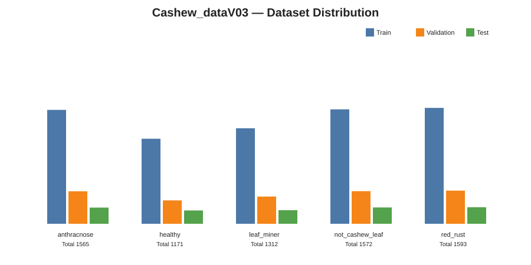

# EXP-DENSENET121-SCRATCH-5SEEDS-002

**Model:** DenseNet121 trained from scratch  
**Dataset:** Cashew_dataV03  
**Seeds:** `42, 123, 2026, 3407, 7777`  
**Status:** ✅ Valid 5-seed baseline

## Dataset

| Class | Train | Validation | Test | Total |
|---|---:|---:|---:|---:|
| `anthracnose` | 1,096 | 313 | 156 | 1,565 |
| `healthy` | 818 | 225 | 128 | 1,171 |
| `leaf_miner` | 919 | 262 | 131 | 1,312 |
| `not_cashew_leaf` | 1,101 | 314 | 157 | 1,572 |
| `red_rust` | 1,115 | 319 | 159 | 1,593 |
| **TOTAL** | **5,049** | **1,433** | **731** | **7,213** |

## Configuration

- Input size: `224 × 224 × 3`
- DenseNet121 `weights=None`, `include_top=False`
- Head: GAP → Dense(512, ReLU) → BatchNorm → Dropout(0.40) → Softmax(5)
- Batch size: `32`
- Optimizer: Adam
- Initial learning rate: `1e-3`
- Loss: SparseCategoricalCrossentropy
- Max epochs: `50`
- Checkpoint monitor: minimum `val_loss`
- EarlyStopping patience: `8`
- ReduceLROnPlateau: patience `3`, factor `0.3`
- Backbone call: `x = backbone(x)` — no forced `training=True`

## Training curves across 5 seeds

All five runs are placed side-by-side so seed-to-seed variation can be inspected directly.

## Per-seed results

| Seed | Val Accuracy | Val Macro F1 | Test Accuracy | Test Macro F1 |
|---:|---:|---:|---:|---:|
| 42 | 89.18% | 89.17% | 89.88% | 90.02% |
| 123 | 86.18% | 85.52% | 90.83% | 90.85% |
| 2026 | 82.90% | 83.23% | 83.45% | 84.28% |
| 3407 | **90.16%** | **89.95%** | **91.79%** | **91.73%** |
| 7777 | 84.65% | 84.53% | 89.06% | 89.20% |

## Final Test — Mean ± Std

| Metric | Result |
|---|---:|
| Accuracy | **89.00 ± 3.27%** |
| Macro Precision | **90.20 ± 2.03%** |
| Macro Recall | **89.00 ± 3.20%** |
| Macro F1 | **89.22 ± 2.92%** |
| Balanced Accuracy | **89.00 ± 3.20%** |
| Weighted F1 | **89.18 ± 3.01%** |

## Per-class Test performance

| Class | Precision Mean | Recall Mean | F1 Mean ± Std |
|---|---:|---:|---:|
| `anthracnose` | 75.26% | 86.41% | **79.99 ± 4.73%** |
| `healthy` | 88.55% | 91.09% | **89.75 ± 4.14%** |
| `leaf_miner` | 94.25% | 87.33% | **90.50 ± 2.40%** |
| `not_cashew_leaf` | 97.16% | 84.97% | **90.46 ± 6.19%** |
| `red_rust` | 95.76% | 95.22% | **95.39 ± 1.73%** |

### Main observations

- `red_rust` is the strongest and most stable class.
- `anthracnose` remains the hardest class and has the lowest mean F1.
- Seed `2026` is substantially weaker and is retained because seed variance is part of robustness measurement.
- Deployment seed `3407` was selected using **Validation only**, not Test.

## Comparison with ResNet50 baseline

| Model | Test Accuracy | Macro F1 | Parameters |
|---|---:|---:|---:|
| ResNet50 Scratch 5-seed | **90.10 ± 1.82%** | **90.12 ± 1.81%** | 24.64M |
| DenseNet121 Scratch 5-seed | 89.00 ± 3.27% | 89.22 ± 2.92% | **7.57M** |

DenseNet121 is lighter, while ResNet50 currently provides the stronger and more stable classification baseline.

## YOLO / downstream reuse

The FULL long-term archive contains all five best checkpoints, deployment model, DenseNet121 feature extractor, embedding model, label map, deployment metadata and reusable integration scripts. Large model binaries are intentionally not committed to GitHub.

## Scientific rules

- Same fixed Train/Validation/Test split across all seeds.
- Same hyperparameters across all seeds.
- Validation is used for checkpointing and deployment-seed selection.
- Test is never used for hyperparameter tuning or seed selection.
- Results are reported as **Mean ± sample standard deviation (`ddof=1`)**.
