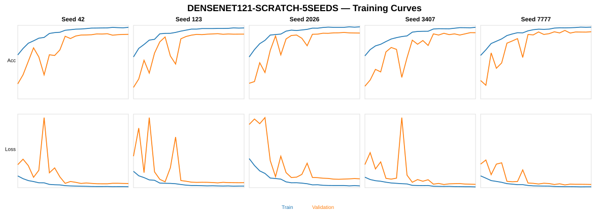

# EXP-DENSENET121-SCRATCH-5SEEDS-003

**Model:** DenseNet121 from scratch  
**Dataset:** Cashew_dataV04  
**Seeds:** `[42, 123, 2026, 3407, 7777]`

## Dataset

| Class | Train | Val | Test | Total |
|---|---:|---:|---:|---:|
| anthracnose | 945 | 294 | 122 | 1361 |
| healthy | 806 | 225 | 118 | 1149 |
| leaf_miner | 893 | 249 | 132 | 1274 |
| not_cashew_leaf | 1101 | 314 | 157 | 1572 |
| red_rust | 1077 | 320 | 158 | 1555 |
| **TOTAL** | **4822** | **1402** | **687** | **6911** |

## Configuration

- Input: `224×224`
- Batch size: `32`
- Initial LR: `0.001`
- Max epochs: `50`
- Optimizer: Adam
- Checkpoint: minimum val_loss
- Backbone call: `x = backbone(x)`

## Training curves — 5 seeds side-by-side

## Validation Mean ± Std

| Metric | Result |
|---|---:|
| val_accuracy | **89.87 ± 1.85%** |
| val_macro_precision | **89.84 ± 1.82%** |
| val_macro_recall | **89.62 ± 1.85%** |
| val_macro_f1 | **89.53 ± 1.96%** |
| val_balanced_accuracy | **89.62 ± 1.85%** |

## Final Test Mean ± Std

| Metric | Result |
|---|---:|
| accuracy | **91.82 ± 0.86%** |
| macro_precision | **91.61 ± 0.77%** |
| macro_recall | **91.40 ± 0.80%** |
| macro_f1 | **91.37 ± 0.79%** |
| balanced_accuracy | **91.40 ± 0.80%** |
| weighted_f1 | **91.88 ± 0.76%** |

## Deployment / YOLO integration

Deployment seed selected from Validation only: **7777**.

Reusable files trong FULL archive:
- `model_package/deployment_model.keras`
- `model_package/densenet121_feature_extractor.keras`
- `model_package/densenet121_embedding_model.keras`
- `code/yolo_classifier_adapter.py`
- `code/continue_training_example.py`

## Scientific rules

- Same Train/Val/Test split for all seeds.
- Same hyperparameters for all seeds.
- Test is not used for tuning.
- Deployment seed is selected from Validation only.
- Mean ± sample standard deviation (`ddof=1`).

## Per-seed summary

| Seed | Val Accuracy | Val Macro F1 | Test Accuracy | Test Macro F1 |
|---:|---:|---:|---:|---:|
| 42 | 88.45% | 87.97% | 92.14% | 91.59% |
| 123 | 88.59% | 88.10% | 92.29% | 91.97% |
| 2026 | 89.87% | 89.61% | 91.41% | 91.01% |
| 3407 | 89.44% | 89.18% | 90.54% | 90.18% |
| 7777 | 93.01% | 92.81% | 92.72% | 92.13% |

## Per-class Test results (5-seed mean ± SD)

| Class | Precision | Recall | F1 |
|---|---:|---:|---:|
| `anthracnose` | 80.12% | 83.11% | **81.30 ± 2.00%** |
| `healthy` | 90.09% | 93.39% | **91.68 ± 1.51%** |
| `leaf_miner` | 94.33% | 88.64% | **91.29 ± 1.37%** |
| `not_cashew_leaf` | 98.39% | 93.76% | **96.02 ± 1.35%** |
| `red_rust` | 95.12% | 98.10% | **96.58 ± 0.42%** |

Total parameters: **7,566,917**.

## GitHub package

Repository chỉ lưu README, config, per-seed aggregate metrics và figure nhẹ. Các confusion-matrix panel đầy đủ, checkpoint `.weights.h5`, model `.keras` và FULL ZIP được giữ trong experiment archive thay vì commit trực tiếp lên GitHub.
