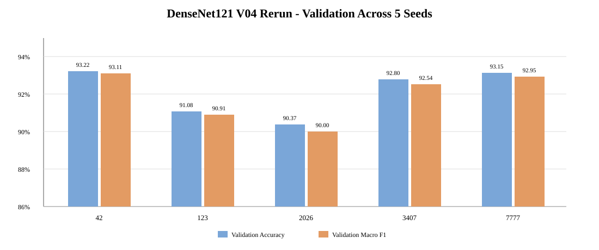
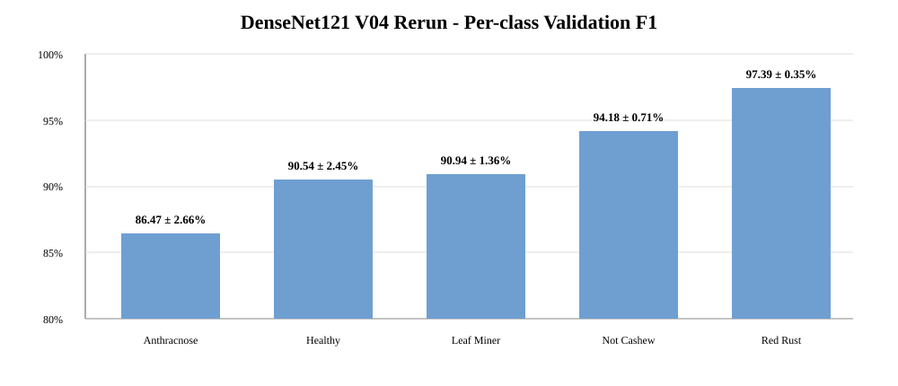

# EXP-DENSENET121-SCRATCH-5SEEDS-004

**Model:** DenseNet121 Scratch  
**Dataset:** `Cashew_dataV04`  
**Seeds:** `42, 123, 2026, 3407, 7777`  
**Runtime:** Google Colab — single GPU / `OneDeviceStrategy`  
**Status:** 🟡 **Validation complete — final locked Test evaluation pending**

> **Repository ID note:** the uploaded archive self-reported `EXP-DENSENET121-SCRATCH-5SEEDS-003`, but that ID already exists in the repository as the official V04 DenseNet121 locked-Test benchmark. To preserve experiment history and follow the no-overwrite rule, this rerun is stored as **EXP-004**. The original source config is preserved in `experiment_config_source.json`.

## Dataset

| Class | Train | Validation | Test | Total |
|---|---:|---:|---:|---:|
| `anthracnose` | 945 | 294 | 122 | 1,361 |
| `healthy` | 806 | 225 | 118 | 1,149 |
| `leaf_miner` | 893 | 249 | 132 | 1,274 |
| `not_cashew_leaf` | 1,101 | 314 | 157 | 1,572 |
| `red_rust` | 1,077 | 320 | 158 | 1,555 |
| **TOTAL** | **4,822** | **1,402** | **687** | **6,911** |

## Configuration

- Input: `224×224×3`
- Batch size: `32`
- Max epochs: `50`
- Optimizer: `Adam`
- Initial learning rate: `1e-3`
- Loss: `SparseCategoricalCrossentropy`
- Training mode: scratch (`weights=None`)
- Head: Dense(512) + Dropout(0.40) + Dense(5)
- Total parameters: `7,566,917`
- Trainable parameters: `7,482,245`
- Checkpoint monitor: minimum `val_loss`
- EarlyStopping patience: `8`
- ReduceLROnPlateau: factor `0.3`, patience `3`, min LR `1e-6`
- Augmentation: horizontal flip, rotation `0.04`, zoom `0.05`, translation `0.03`, contrast `0.08`
- Execution strategy: 1 GPU, `OneDeviceStrategy`

## Validation results — 5 seeds

| Seed | Val Accuracy | Macro Precision | Macro Recall | Macro F1 | Balanced Acc | Best epoch |
|---:|---:|---:|---:|---:|---:|---:|
| 42 | 93.22% | 93.37% | 92.99% | 93.11% | 92.99% | 21 |
| 123 | 91.08% | 91.53% | 90.61% | 90.91% | 90.61% | 16 |
| 2026 | 90.37% | 90.60% | 89.66% | 90.00% | 89.66% | 24 |
| 3407 | 92.80% | 92.83% | 92.39% | 92.54% | 92.39% | 29 |
| 7777 | 93.15% | 93.11% | 92.86% | 92.95% | 92.86% | 24 |

### Aggregate validation

| Metric | Mean ± sample SD |
|---|---:|
| Validation Accuracy | **92.13 ± 1.31%** |
| Validation Macro Precision | **92.29 ± 1.18%** |
| Validation Macro Recall | **91.70 ± 1.49%** |
| Validation Macro F1 | **91.90 ± 1.37%** |
| Balanced Accuracy | **91.70 ± 1.49%** |

## Per-class validation

| Class | Precision | Recall | F1 ± SD |
|---|---:|---:|---:|
| `anthracnose` | 83.77% | 89.46% | **86.47 ± 2.66%** |
| `healthy` | 91.46% | 89.69% | **90.54 ± 2.45%** |
| `leaf_miner` | 95.57% | 86.75% | **90.94 ± 1.36%** |
| `not_cashew_leaf` | 95.03% | 93.38% | **94.18 ± 0.71%** |
| `red_rust` | 95.61% | 99.25% | **97.39 ± 0.35%** |

`anthracnose` remains the weakest class by F1, while `red_rust` is the strongest and most stable.

## Comparison with official DenseNet121 EXP-003

The repository's existing `EXP-DENSENET121-SCRATCH-5SEEDS-003` is the official V04 locked-Test benchmark. The uploaded rerun uses the same V04 dataset counts, seeds and core hyperparameters, but a different execution environment/strategy (old run: 2-GPU `MirroredStrategy`; this rerun: 1-GPU `OneDeviceStrategy`). Treat the change as a rerun result rather than evidence that the model architecture itself improved.

| Metric | Official EXP-003 | Rerun EXP-004 | Change |
|---|---:|---:|---:|
| Validation Accuracy | 89.87 ± 1.85% | **92.13 ± 1.31%** | **+2.26 pp mean** |
| Validation Macro F1 | 89.53 ± 1.96% | **91.90 ± 1.37%** | **+2.37 pp mean** |
| Accuracy SD | 1.85% | **1.31%** | **−0.54 pp** |
| Macro-F1 SD | 1.96% | **1.37%** | **−0.59 pp** |

Unlike the ResNet50 rerun, DenseNet121 improved on Validation Accuracy and Macro-F1 for **all five seeds** relative to the previous EXP-003 validation results. The largest gain is seed `42`; seed `7777` changes only slightly because it was already strong in the prior run.

## Training behavior

- Mean actual training length: **30.8 epochs**
- Mean best checkpoint epoch: **22.8**
- Mean training time: **33.84 min/seed**
- Total 5-seed training time: **169.22 min**
- Mean Train–Validation accuracy gap at the minimum-`val_loss` checkpoint: **4.59 percentage points**
- Best checkpoint files are about **87.30 MB** each in the source run.
- EarlyStopping ends runs 8 epochs after the best `val_loss` checkpoint, consistent with the configured patience.
- The learning curves show noisy validation behavior in early epochs but much more stable convergence after roughly epoch 12–16.

## Recurring validation confusions

The confusion matrix is summed across five seeds, so counts below are recurring prediction events, not unique-image counts.

1. `leaf_miner → anthracnose`: **104** events
2. `healthy → anthracnose`: **82** events
3. `not_cashew_leaf → anthracnose`: **63** events
4. `anthracnose → healthy`: **56** events
5. `anthracnose → red_rust`: **50** events
6. `leaf_miner → not_cashew_leaf`: **43** events

The dominant error pattern again involves `anthracnose`: other classes are often pulled into `anthracnose`, while anthracnose itself is confused most often with `healthy` and `red_rust`. This matches its lower per-class F1.

## Model-selection note

Using the predefined **Validation Macro-F1** rule with lower `val_loss` only as a tie-break, seed **42** is the current candidate checkpoint (`Val Macro-F1 = 93.11%`). This is a validation-only selection; Test is not involved.

## Experiment status and next step

This rerun is **not yet a completed final benchmark** because `run_final_test=false` and no Test metrics are present in the uploaded archive. Therefore it does **not** replace the official DenseNet121 EXP-003 Test row yet.

To finalize EXP-004:

1. Freeze the five current checkpoints/configuration.
2. Run the locked Test Set on all five checkpoints without changing hyperparameters.
3. Aggregate Test Accuracy, Macro Precision/Recall/F1 and Balanced Accuracy as mean ± sample SD.
4. Measure inference time/FPS in a documented environment.
5. Only then decide whether EXP-004 replaces EXP-003 in `benchmark_v04.csv`.

Detailed discussion: [`ANALYSIS.md`](./ANALYSIS.md)

## Machine-readable files

- [`experiment_config.json`](./experiment_config.json) — repository-normalized ID `004`
- [`experiment_config_source.json`](./experiment_config_source.json) — exact source archive config with original duplicate ID `003`
- [`environment.json`](./environment.json)
- [`dataset_statistics.csv`](./dataset_statistics.csv)
- [`aggregate/training_summary_5seeds.csv`](./aggregate/training_summary_5seeds.csv)
- [`aggregate/validation_results_5seeds.csv`](./aggregate/validation_results_5seeds.csv)
- [`aggregate/validation_mean_std_summary.csv`](./aggregate/validation_mean_std_summary.csv)
- [`aggregate/per_class_validation_mean_std.csv`](./aggregate/per_class_validation_mean_std.csv)
- [`aggregate/validation_confusion_matrix_5seeds_sum.csv`](./aggregate/validation_confusion_matrix_5seeds_sum.csv)
- [`aggregate/learning_curve_diagnostics.csv`](./aggregate/learning_curve_diagnostics.csv)
- [`aggregate/comparison_vs_densenet121_003.csv`](./aggregate/comparison_vs_densenet121_003.csv)

Large checkpoints, predictions and the FULL archive remain outside GitHub.
