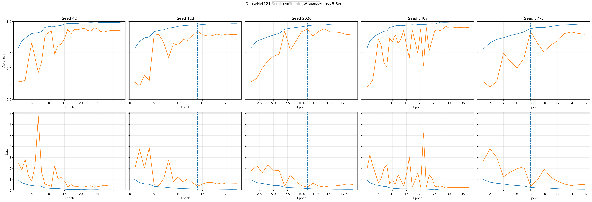
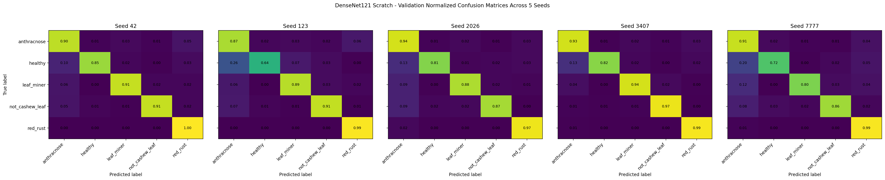
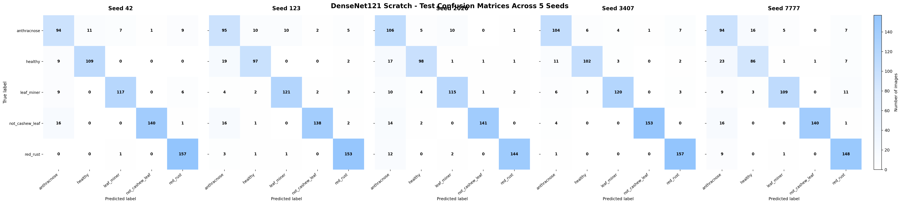
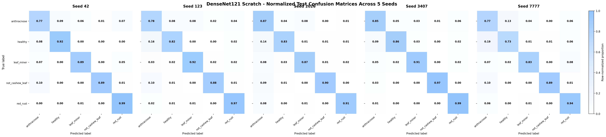

# EXP-DENSENET121-SCRATCH-5SEEDS-006

**Model:** DenseNet121 from scratch  
**Dataset:** Cashew_dataV05  
**Seeds:** `[42, 123, 2026, 3407, 7777]`

## Dataset

| Class | Train | Val | Test | Total |
|---|---:|---:|---:|---:|
| anthracnose | 945 | 294 | 122 | 1361 |
| healthy | 806 | 225 | 118 | 1149 |
| leaf_miner | 893 | 249 | 132 | 1274 |
| not_cashew_leaf | 1101 | 314 | 157 | 1572 |
| red_rust | 1077 | 320 | 158 | 1555 |
| **TOTAL** | **4822** | **1402** | **687** | **6911** |

## Configuration

- Input: `224×224`
- Batch size: `32`
- Initial LR: `0.0003`
- Max epochs: `50`
- Optimizer: Adam
- Checkpoint: minimum val_loss
- Backbone call: `x = backbone(x)`

## Training curves — 5 seeds side-by-side

## Validation confusion matrices — 5 seeds side-by-side

## Validation Mean ± Std

| Metric | Result |
|---|---:|
| val_accuracy | **89.97 ± 2.90%** |
| val_macro_precision | **90.91 ± 2.44%** |
| val_macro_recall | **89.15 ± 3.18%** |
| val_macro_f1 | **89.61 ± 3.08%** |
| val_balanced_accuracy | **89.15 ± 3.18%** |

## Final Test Mean ± Std

| Metric | Result |
|---|---:|
| accuracy | **88.44 ± 3.14%** |
| macro_precision | **88.49 ± 2.82%** |
| macro_recall | **87.83 ± 3.23%** |
| macro_f1 | **87.95 ± 3.14%** |
| balanced_accuracy | **87.83 ± 3.23%** |
| weighted_f1 | **88.64 ± 2.99%** |

## Test confusion matrices — 5 seeds side-by-side

## Normalized Test confusion matrices — 5 seeds side-by-side

## Deployment / YOLO integration

Deployment seed selected from Validation only: **3407**.

Reusable files:
- `model_package/deployment_model.keras`
- `model_package/densenet121_feature_extractor.keras`
- `model_package/densenet121_embedding_model.keras`
- `code/yolo_classifier_adapter.py`
- `code/continue_training_example.py`

## Google Drive archive

Full ZIP destination: /content/drive/MyDrive/Cashew_Leaf_model_result/training_results/current_dataset

Archive name: `EXP-DENSENET121-SCRATCH-5SEEDS-006_FULL.zip`

## Scientific rules

- Same Train/Val/Test split for all seeds.
- Same hyperparameters for all seeds.
- Test is not used for tuning.
- Deployment seed is selected from Validation only.
- Mean ± sample standard deviation (`ddof=1`).