# EXP-RESNET50-SCRATCH-5SEEDS-002

> ✅ **Official baseline — Current Dataset (`Cashew_dataV03`)**  
> ResNet50 được huấn luyện **from scratch** trên 5 random seeds với cùng một configuration. Kết quả được báo cáo theo **Mean ± sample Standard Deviation (ddof=1)**.

## Headline Result

| Metric | Mean ± Std |
|---|---:|
| Test Accuracy | **90.10 ± 1.82%** |
| Macro Precision | **90.42 ± 1.82%** |
| Macro Recall | **90.09 ± 1.79%** |
| Macro F1 | **90.12 ± 1.81%** |
| Balanced Accuracy | **90.09 ± 1.79%** |
| Weighted F1 | **90.14 ± 1.75%** |

## Dataset

- Version: **Cashew_dataV03**
- Total: **7,213 ảnh**
- Split cố định: **5,049 Train / 1,433 Validation / 731 Test**
- Test locked: **True**
- Dataset distribution workbook: [`dataset_cashew.xlsx`](../../../dataset_cashew.xlsx)

| Class | Train | Validation | Test | Total |
|---|---:|---:|---:|---:|
| `anthracnose` | 1,096 | 313 | 156 | 1,565 |
| `healthy` | 818 | 225 | 128 | 1,171 |
| `leaf_miner` | 919 | 262 | 131 | 1,312 |
| `not_cashew_leaf` | 1,101 | 314 | 157 | 1,572 |
| `red_rust` | 1,115 | 319 | 159 | 1,593 |
| **TOTAL** | **5,049** | **1,433** | **731** | **7,213** |

## Model & Training Configuration

| Item | Configuration |
|---|---|
| Architecture | ResNet50 |
| Training mode | Scratch |
| Pretrained weights | None |
| Input size | 224 × 224 |
| Classifier head | Dense(512) + BatchNorm + Dropout(0.40) |
| Batch size | 32 |
| Max epochs | 50 |
| Optimizer | Adam |
| Initial LR | 1e-3 |
| Loss | SparseCategoricalCrossentropy |
| EarlyStopping | `val_loss`, patience = 8 |
| ReduceLROnPlateau | `val_loss`, patience = 3, factor = 0.3 |
| Checkpoint | minimum `val_loss` |
| Seeds | `42, 123, 2026, 3407, 7777` |
| Backbone call | `x = backbone(x)` |
| Forced `training=True` | **False** |

## 5-Seed Test Results

| Seed | Test Accuracy | Macro F1 | Balanced Accuracy | Correct / 731 |
|---:|---:|---:|---:|---:|
| 42 | 91.38% | 91.41% | 91.16% | 668 |
| 123 | 87.55% | 87.50% | 87.37% | 640 |
| 2026 | 91.24% | 91.26% | 91.30% | 667 |
| 3407 | **91.52%** | **91.49%** | **91.47%** | **669** |
| 7777 | 88.78% | 88.94% | 89.16% | 649 |
| **Mean ± Std** | **90.10 ± 1.82%** | **90.12 ± 1.81%** | **90.09 ± 1.79%** | — |

> Không chọn seed 3407 làm kết quả đại diện dù seed này cao nhất trên Test. Giá trị báo cáo chính thức luôn là **Mean ± Std của cả 5 seeds**.

## Validation Summary

| Metric | Mean ± Std |
|---|---:|
| Validation Accuracy | **86.76 ± 0.74%** |
| Macro Precision | **87.25 ± 0.81%** |
| Macro Recall | **86.60 ± 0.43%** |
| Macro F1 | **86.59 ± 0.63%** |
| Balanced Accuracy | **86.60 ± 0.43%** |

- Best epoch: **18.00 ± 4.47**
- Training time / seed: **27.66 ± 4.65 phút**

## Per-Class Performance — Test Mean ± Std

| Class | Precision Mean | Recall Mean | F1 Mean ± Std |
|---|---:|---:|---:|
| `anthracnose` | 80.74% | 83.97% | **82.26 ± 2.55%** |
| `healthy` | 87.72% | 92.34% | **89.85 ± 4.75%** |
| `leaf_miner` | 92.89% | 88.09% | **90.36 ± 1.30%** |
| `not_cashew_leaf` | 95.11% | 91.85% | **93.27 ± 3.11%** |
| `red_rust` | 95.66% | 94.21% | **94.86 ± 1.03%** |

**Nhận xét:** `anthracnose` là lớp khó nhất và có F1 thấp nhất. `red_rust` là lớp ổn định nhất. Đây là hai mốc quan trọng để đánh giá các experiment cải tiến sau này.

---

## Representative Visuals — Seed 42

Seed 42 được chọn để **minh họa trực quan** vì đây là seed cố định đầu tiên trong protocol, không phải seed có Test score cao nhất.

<table>
<tr>
<th>Accuracy Curve</th>
<th>Loss Curve</th>
</tr>
<tr>
<td width="50%"></td>
<td width="50%">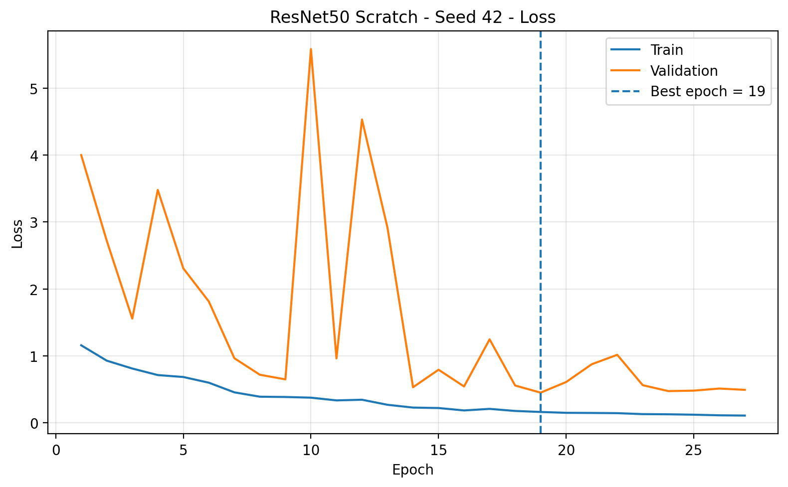</td>
</tr>
</table>

### Normalized Test Confusion Matrix — Seed 42

  

---

## Learning Curves — All 5 Seeds

<strong>Accuracy curves</strong>

 
<table>
<tr><th>Seed 42</th><th>Seed 123</th></tr>
<tr>
<td></td>
<td>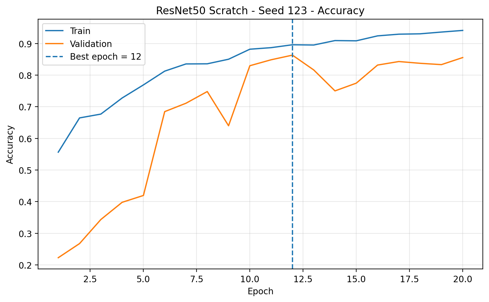</td>
</tr>
<tr><th>Seed 2026</th><th>Seed 3407</th></tr>
<tr>
<td>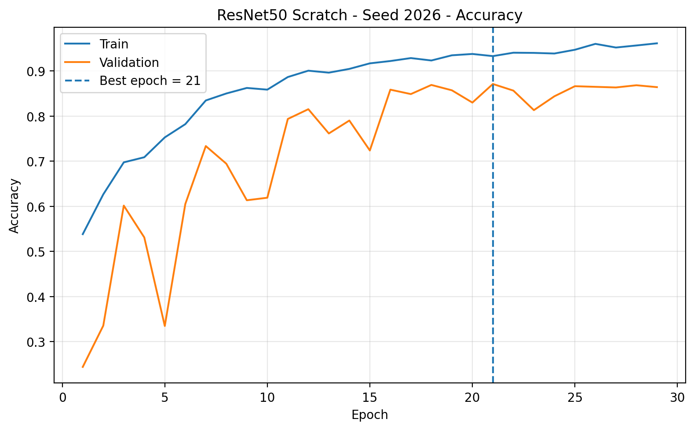</td>
<td>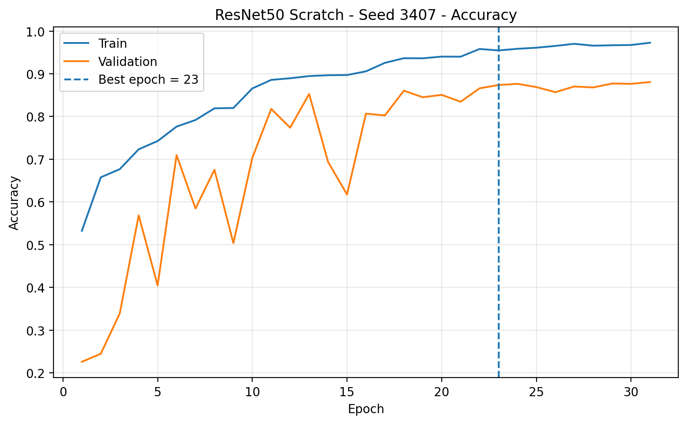</td>
</tr>
<tr><th colspan="2">Seed 7777</th></tr>
<tr><td colspan="2" align="center">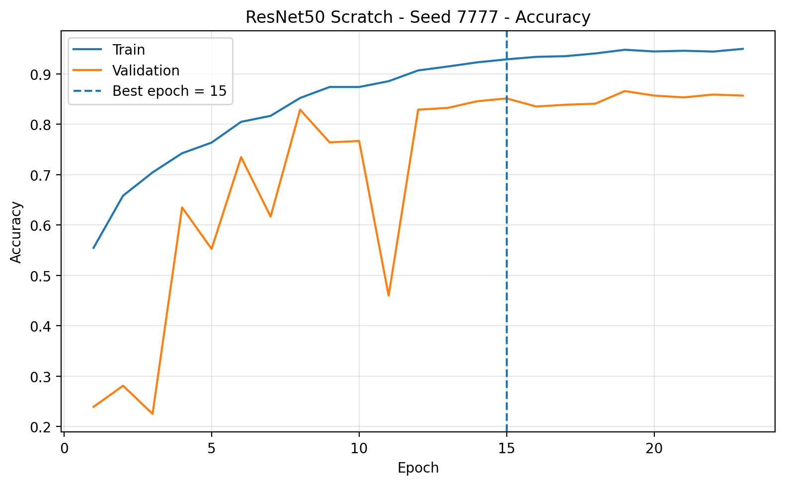</td></tr>
</table>

<strong>Loss curves</strong>

 
<table>
<tr><th>Seed 42</th><th>Seed 123</th></tr>
<tr>
<td></td>
<td>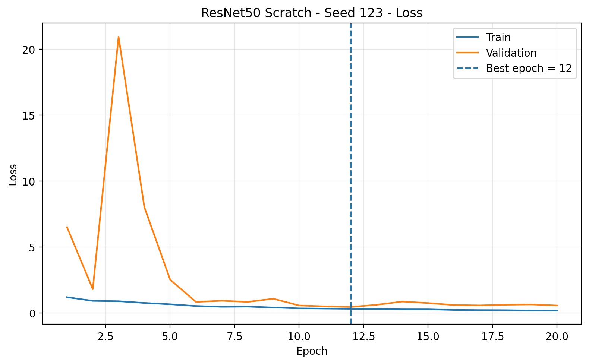</td>
</tr>
<tr><th>Seed 2026</th><th>Seed 3407</th></tr>
<tr>
<td>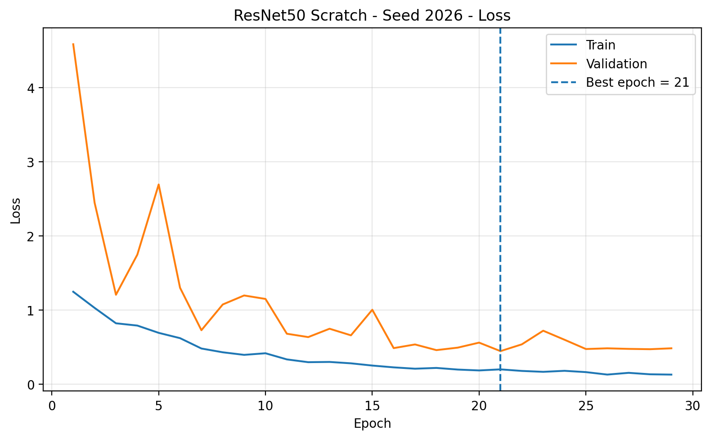</td>
<td>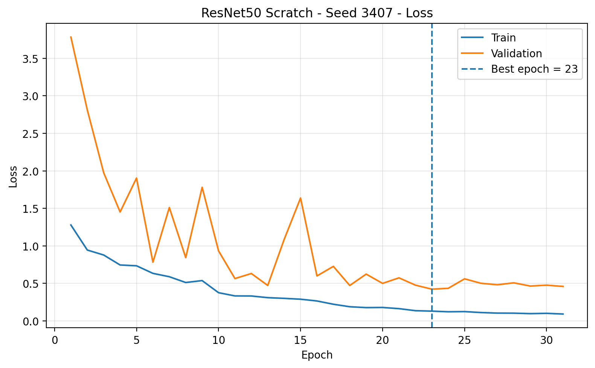</td>
</tr>
<tr><th colspan="2">Seed 7777</th></tr>
<tr><td colspan="2" align="center">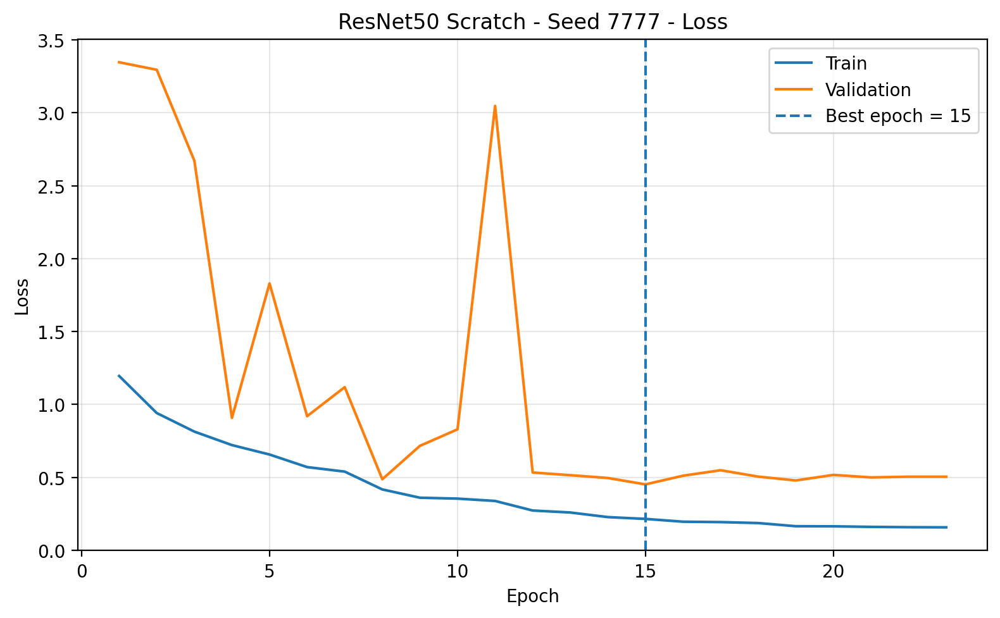</td></tr>
</table>

## Normalized Test Confusion Matrices — All Seeds

<strong>Show confusion matrices</strong>

 
<table>
<tr><th>Seed 42</th><th>Seed 123</th></tr>
<tr>
<td></td>
<td>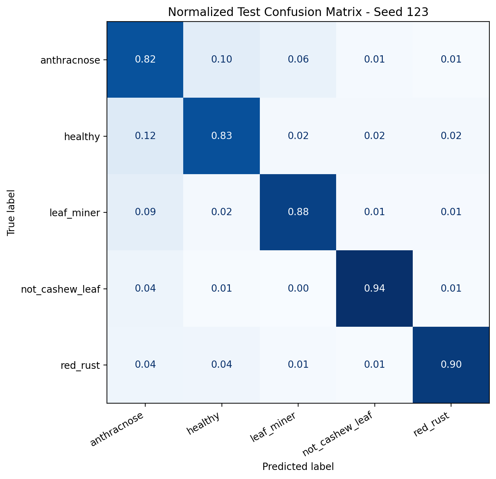</td>
</tr>
<tr><th>Seed 2026</th><th>Seed 3407</th></tr>
<tr>
<td></td>
<td>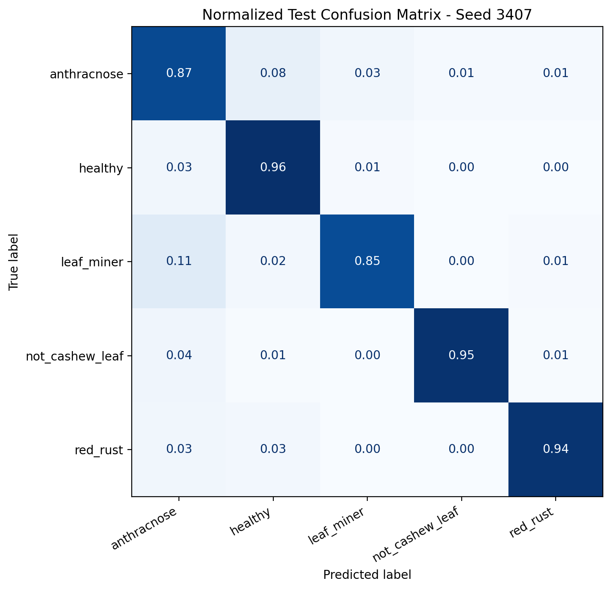</td>
</tr>
<tr><th colspan="2">Seed 7777</th></tr>
<tr><td colspan="2" align="center">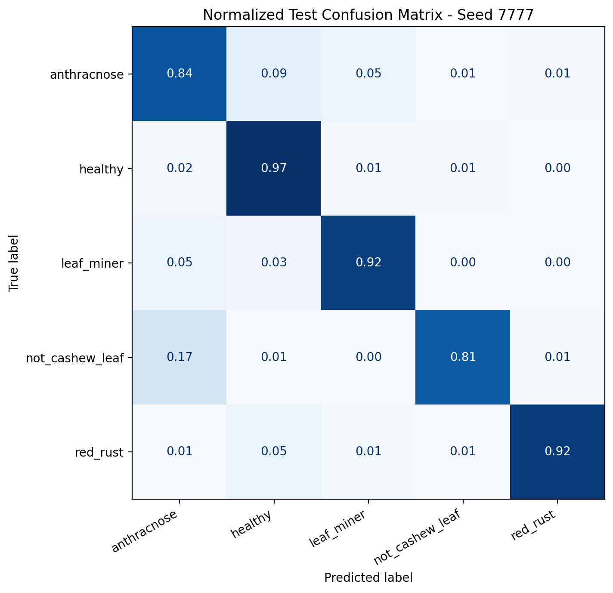</td></tr>
</table>

---

## Scientific Protocol

- Same Train / Validation / Test split for all seeds.
- Chỉ random seed thay đổi giữa các run; hyperparameters được giữ nguyên.
- Validation dùng để checkpoint, EarlyStopping và ReduceLROnPlateau.
- Test Set đã khóa và không dùng để tuning hyperparameter hoặc chọn seed.
- Report chính thức: **Mean ± sample Standard Deviation (ddof=1)**.

## GitHub Artifacts

Repo lưu các artifact nhẹ phục vụ tái lập, kiểm tra và viết khóa luận. Checkpoint `.weights.h5` (~282 MB/seed) không commit để tránh làm repository quá nặng.

### Aggregate files

- [`aggregate/aggregate_test_results.csv`](./aggregate/aggregate_test_results.csv)
- [`aggregate/test_mean_std_summary.csv`](./aggregate/test_mean_std_summary.csv)
- [`aggregate/thesis_test_mean_std_summary.csv`](./aggregate/thesis_test_mean_std_summary.csv)
- [`aggregate/per_class_test_mean_std.csv`](./aggregate/per_class_test_mean_std.csv)
- [`aggregate/training_summary_5seeds.csv`](./aggregate/training_summary_5seeds.csv)
- [`aggregate/validation_results_5seeds.csv`](./aggregate/validation_results_5seeds.csv)
- [`aggregate/validation_mean_std_summary.csv`](./aggregate/validation_mean_std_summary.csv)
- [`aggregate/seed_details.json`](./aggregate/seed_details.json)
- [`experiment_config.json`](./experiment_config.json)

### Raw per-seed figures / CSV

- [`5_seed_resnet50_v02/`](./5_seed_resnet50_v02/5_seed_resnet50_v02/)

---

## Main Takeaway

ResNet50 scratch đạt **90.10 ± 1.82% Test Accuracy** và **90.12 ± 1.81% Macro F1** trên 5 seeds. Model có khả năng phân loại tốt trên `red_rust`, `not_cashew_leaf` và `leaf_miner`, trong khi `anthracnose` vẫn là lớp khó nhất. Baseline này được giữ cố định để làm mốc so sánh cho các experiment tiếp theo, đặc biệt các thử nghiệm thay đổi learning rate, batch size hoặc regularization.
