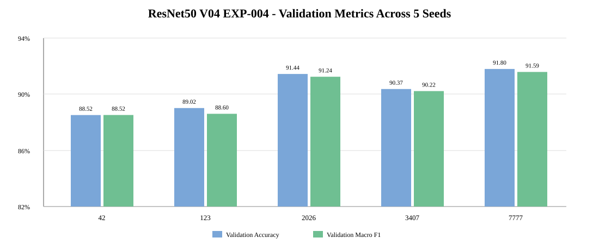
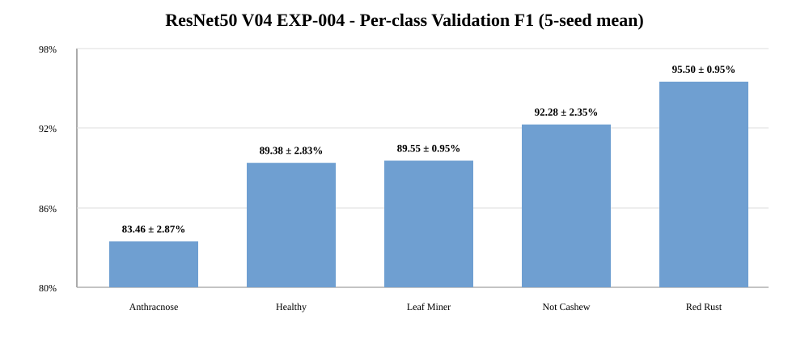

# EXP-RESNET50-SCRATCH-5SEEDS-004

**Model:** ResNet50 Scratch  
**Dataset:** `Cashew_dataV04`  
**Seeds:** `42, 123, 2026, 3407, 7777`  
**Runtime:** Google Colab — NVIDIA L4  
**Status:** 🟡 **Validation complete — final locked Test evaluation pending**

> Experiment 004 has completed training and validation for all 5 seeds. `run_final_test=false`, therefore it must **not** replace the official V04 Test benchmark yet.

## Dataset

| Class | Train | Validation | Test | Total |
|---|---:|---:|---:|---:|
| `anthracnose` | 945 | 294 | 122 | 1,361 |
| `healthy` | 806 | 225 | 118 | 1,149 |
| `leaf_miner` | 893 | 249 | 132 | 1,274 |
| `not_cashew_leaf` | 1,101 | 314 | 157 | 1,572 |
| `red_rust` | 1,077 | 320 | 158 | 1,555 |
| **TOTAL** | **4,822** | **1,402** | **687** | **6,911** |

The Test Set is locked and has the recorded SHA-256 split fingerprint in `experiment_config.json`.

## Configuration

- Input: `224×224×3`
- Batch size: `32`
- Max epochs: `50`
- Optimizer: `Adam`
- Initial learning rate: `1e-3`
- Loss: `sparse_categorical_crossentropy`
- Training mode: Scratch (`weights=None`)
- Head: `Dense(512) + Dropout(0.40) + Dense(5)`
- Total parameters: `24,641,413`
- Trainable parameters: `24,587,269`
- Checkpoint monitor: minimum `val_loss`
- EarlyStopping patience: `8`
- ReduceLROnPlateau: factor `0.3`, patience `3`, min LR `1e-6`
- Augmentation: horizontal flip, rotation `0.04`, zoom `0.05`, translation `0.03`, contrast `0.08`
- Hardware: 1 × NVIDIA L4, `OneDeviceStrategy`

## Validation results — 5 seeds

| Seed | Val Accuracy | Macro Precision | Macro Recall | Macro F1 | Balanced Acc | Best epoch |
|---:|---:|---:|---:|---:|---:|---:|
| 42 | 88.52% | 88.78% | 88.58% | 88.52% | 88.58% | 19 |
| 123 | 89.02% | 89.19% | 88.26% | 88.60% | 88.26% | 9 |
| 2026 | 91.44% | 91.46% | 91.15% | 91.24% | 91.15% | 20 |
| 3407 | 90.37% | 91.02% | 89.84% | 90.22% | 89.84% | 16 |
| 7777 | **91.80%** | **91.90%** | **91.39%** | **91.59%** | **91.39%** | 28 |

### Aggregate validation

| Metric | Mean ± sample SD |
|---|---:|
| Validation Accuracy | **90.23 ± 1.45%** |
| Validation Macro Precision | **90.47 ± 1.40%** |
| Validation Macro Recall | **89.84 ± 1.43%** |
| Validation Macro F1 | **90.03 ± 1.44%** |
| Balanced Accuracy | **89.84 ± 1.43%** |

## Per-class validation

| Class | Precision | Recall | F1 ± SD |
|---|---:|---:|---:|
| `anthracnose` | 81.72% | 85.44% | **83.46 ± 2.87%** |
| `healthy` | 91.07% | 88.00% | **89.38 ± 2.83%** |
| `leaf_miner` | 93.28% | 86.18% | **89.55 ± 0.95%** |
| `not_cashew_leaf` | 93.25% | 91.46% | **92.28 ± 2.35%** |
| `red_rust` | 93.05% | **98.13%** | **95.50 ± 0.95%** |

`anthracnose` remains the hardest class. The strongest and most stable class is `red_rust`.

## Comparison with EXP-RESNET50-SCRATCH-5SEEDS-003

Both experiments use the same V04 dataset, seeds and core hyperparameters. However, the execution environment differs: 003 ran with `MirroredStrategy` on 2 GPUs, while 004 ran on a single NVIDIA L4 with `OneDeviceStrategy`. The validation change therefore should be treated as a rerun result, not automatically attributed to a modeling improvement.

| Metric | 003 | 004 | Change |
|---|---:|---:|---:|
| Val Accuracy | 88.22 ± 2.49% | **90.23 ± 1.45%** | **+2.01 pp mean** |
| Val Macro F1 | 88.06 ± 2.52% | **90.03 ± 1.44%** | **+1.97 pp mean** |
| Accuracy SD | 2.49% | **1.45%** | **−1.05 pp** |
| Macro-F1 SD | 2.52% | **1.44%** | **−1.09 pp** |

The improvement is not uniform across seeds: seeds `123`, `2026`, and `7777` improved, while `42` and `3407` decreased slightly.

## Training behavior

- Mean actual training length: **26.4 epochs**
- Mean best checkpoint epoch: **18.4**
- Mean training time: **23.62 min/seed**
- Total 5-seed training time: **118.09 min**
- Best checkpoint size reported by the run: **282.23 MB**
- EarlyStopping consistently terminated training 8 epochs after the minimum-`val_loss` checkpoint.
- At the selected checkpoint, the mean Train–Validation accuracy gap was about **4.21 percentage points**.
- Several runs show validation loss increasing after the best checkpoint, especially seeds `123` and `7777`, which supports keeping EarlyStopping and checkpointing by `val_loss`.

## Recurring validation confusions

The summed confusion matrix counts each validation image once per seed, so these are **recurring prediction events across five runs**, not unique-image counts.

Most frequent off-diagonal pairs:

1. `healthy → anthracnose`: 97 events
2. `leaf_miner → anthracnose`: 92
3. `not_cashew_leaf → anthracnose`: 80
4. `anthracnose → red_rust`: 80
5. `anthracnose → healthy`: 68
6. `leaf_miner → not_cashew_leaf`: 61

The error pattern confirms that `anthracnose` is both the weakest class by F1 and a common sink/source of confusion.

## Model-selection note

If a single checkpoint must be selected **using Validation only**, seed `7777` is the current candidate because it has the highest Validation Macro-F1 (**91.59%**). This is not a Test-based selection.

## Experiment status and next step

This run is **not yet a completed final benchmark** because:

- `test_result = null` for all 5 seeds;
- inference time/FPS are not measured;
- the locked Test Set has not been evaluated for this run.

To finalize EXP-004:

1. Freeze the current five checkpoints and configuration.
2. Run the locked Test Set on **all five checkpoints**, without tuning anything.
3. Aggregate Test Accuracy, Macro Precision/Recall/F1 and Balanced Accuracy as mean ± sample SD.
4. Measure inference time/FPS in one documented environment.
5. Only then decide whether EXP-004 replaces EXP-003 in `benchmark_v04.csv` and the repository's official Test benchmark.

Detailed analysis: [`ANALYSIS.md`](./ANALYSIS.md)

## Machine-readable files

- [`experiment_config.json`](./experiment_config.json)
- [`environment.json`](./environment.json)
- [`dataset_statistics.csv`](./dataset_statistics.csv)
- [`aggregate/training_summary_5seeds.csv`](./aggregate/training_summary_5seeds.csv)
- [`aggregate/validation_results_5seeds.csv`](./aggregate/validation_results_5seeds.csv)
- [`aggregate/validation_mean_std_summary.csv`](./aggregate/validation_mean_std_summary.csv)
- [`aggregate/per_class_validation_mean_std.csv`](./aggregate/per_class_validation_mean_std.csv)
- [`aggregate/validation_confusion_matrix_5seeds_sum.csv`](./aggregate/validation_confusion_matrix_5seeds_sum.csv)
- [`aggregate/learning_curve_diagnostics.csv`](./aggregate/learning_curve_diagnostics.csv)
- [`aggregate/comparison_vs_resnet50_003.csv`](./aggregate/comparison_vs_resnet50_003.csv)

Large checkpoints and the full analysis archive remain outside GitHub.