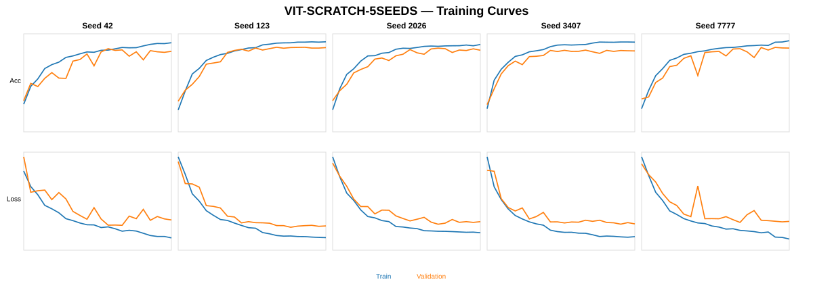

# EXP-VIT-SCRATCH-5SEEDS-003

**Model:** Vision Transformer (ViT) from scratch  
**Dataset:** Cashew_dataV04  
**Seeds:** `[42, 123, 2026, 3407, 7777]`

## Dataset

| Class | Train | Val | Test | Total |
|---|---:|---:|---:|---:|
| anthracnose | 945 | 294 | 122 | 1361 |
| healthy | 806 | 225 | 118 | 1149 |
| leaf_miner | 893 | 249 | 132 | 1274 |
| not_cashew_leaf | 1101 | 314 | 157 | 1572 |
| red_rust | 1077 | 320 | 158 | 1555 |
| **TOTAL** | **4822** | **1402** | **687** | **6911** |

## Configuration

- Input: `224×224`
- Patch size: `16`
- Number of patches: `196`
- Projection dim: `64`
- Heads: `4`
- Transformer blocks: `8`
- Transformer MLP: `128`
- Batch size: `32`
- Initial LR: `0.0003`
- Weight decay: `0.0001`
- Max epochs: `60`
- Optimizer: AdamW
- Checkpoint: minimum val_loss

## Training curves — 5 seeds side-by-side

## Validation Mean ± Std

| Metric | Result |
|---|---:|
| val_accuracy | **85.28 ± 1.28%** |
| val_macro_precision | **85.20 ± 0.88%** |
| val_macro_recall | **84.46 ± 1.66%** |
| val_macro_f1 | **84.68 ± 1.38%** |
| val_balanced_accuracy | **84.46 ± 1.66%** |

## Final Test Mean ± Std

| Metric | Result |
|---|---:|
| accuracy | **85.30 ± 1.68%** |
| macro_precision | **85.04 ± 1.29%** |
| macro_recall | **84.65 ± 1.69%** |
| macro_f1 | **84.41 ± 1.71%** |
| balanced_accuracy | **84.65 ± 1.69%** |
| weighted_f1 | **85.38 ± 1.61%** |

## Deployment / YOLO integration

Deployment seed selected from Validation only: **7777**.

Reusable files trong FULL archive:
- `model_package/deployment_model.keras`
- `model_package/vit_token_feature_extractor.keras`
- `model_package/vit_embedding_model.keras`
- `code/vit_model_builder.py`
- `code/yolo_vit_classifier_adapter.py`
- `code/continue_training_example.py`

## Scientific rules

- Same Train/Val/Test split for all seeds.
- Same hyperparameters for all seeds.
- Test is not used for tuning.
- Deployment seed is selected from Validation only.
- Mean ± sample standard deviation (`ddof=1`).

## Per-seed summary

| Seed | Val Accuracy | Val Macro F1 | Test Accuracy | Test Macro F1 |
|---:|---:|---:|---:|---:|
| 42 | 83.59% | 82.97% | 83.55% | 82.87% |
| 123 | 86.02% | 85.40% | 86.17% | 85.39% |
| 2026 | 85.38% | 84.63% | 86.75% | 85.79% |
| 3407 | 84.52% | 83.86% | 86.61% | 85.76% |
| 7777 | 86.88% | 86.54% | 83.41% | 82.25% |

## Per-class Test results (5-seed mean ± SD)

| Class | Precision | Recall | F1 |
|---|---:|---:|---:|
| `anthracnose` | 74.41% | 67.87% | **70.43 ± 4.44%** |
| `healthy` | 73.13% | 88.14% | **79.72 ± 2.22%** |
| `leaf_miner` | 85.18% | 85.00% | **84.81 ± 2.45%** |
| `not_cashew_leaf` | 98.69% | 95.92% | **97.28 ± 1.37%** |
| `red_rust` | 93.78% | 86.33% | **89.81 ± 1.90%** |

Total parameters: **347,717**.

## GitHub package

Repository chỉ lưu README, config, per-seed aggregate metrics và figure nhẹ. Các confusion-matrix panel đầy đủ, checkpoint `.weights.h5`, model `.keras` và FULL ZIP được giữ trong experiment archive thay vì commit trực tiếp lên GitHub.
