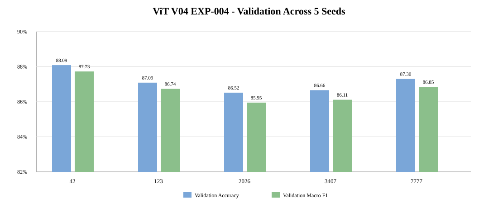
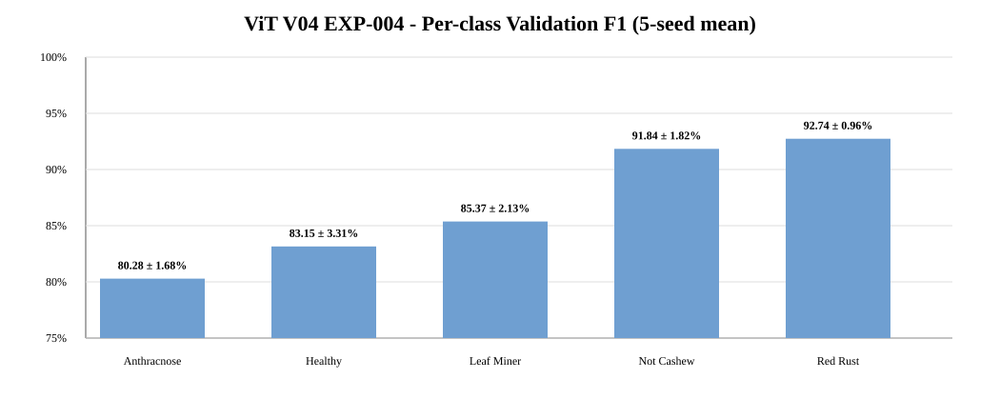

# EXP-VIT-SCRATCH-5SEEDS-004

**Model:** Compact Vision Transformer (ViT) Scratch  
**Dataset:** `Cashew_dataV04`  
**Seeds:** `42, 123, 2026, 3407, 7777`  
**Runtime:** Google Colab / single GPU / `OneDeviceStrategy`  
**Status:** 🟡 **Validation complete — final locked Test evaluation pending**

> **Repository ID note:** the uploaded archive self-reported `EXP-VIT-SCRATCH-5SEEDS-003`, but that ID already exists in the repository as the official V04 ViT locked-Test benchmark. To preserve experiment history and follow the no-overwrite rule, this rerun is stored as **EXP-004**. The exact source config is preserved in `experiment_config_source.json`.

## Dataset

| Class | Train | Validation | Test | Total |
|---|---:|---:|---:|---:|
| `anthracnose` | 945 | 294 | 122 | 1,361 |
| `healthy` | 806 | 225 | 118 | 1,149 |
| `leaf_miner` | 893 | 249 | 132 | 1,274 |
| `not_cashew_leaf` | 1,101 | 314 | 157 | 1,572 |
| `red_rust` | 1,077 | 320 | 158 | 1,555 |
| **TOTAL** | **4,822** | **1,402** | **687** | **6,911** |

## Configuration

- Input: `224×224×3`
- Patch size: `16×16`
- Number of image patches: `196` (+ class token → sequence length `197`)
- Projection dimension: `64`
- Attention heads: `4`
- Transformer blocks: `8`
- Transformer MLP units: `128`
- Head: Dense(256) + Dropout(0.40) + Dense(5)
- Parameters: `347,717` (all trainable)
- Batch size: `32`
- Max epochs: `60`
- Optimizer: `AdamW`
- Initial LR: `3e-4`
- Weight decay: `1e-4`
- Loss: `SparseCategoricalCrossentropy`
- Checkpoint monitor: minimum `val_loss`
- EarlyStopping patience: `10`
- ReduceLROnPlateau: factor `0.3`, patience `4`, min LR `1e-6`
- Augmentation: horizontal flip, rotation `0.04`, zoom `0.05`, translation `0.03`, contrast `0.08`
- Execution strategy: 1 GPU, `OneDeviceStrategy`

## Validation results — 5 seeds

| Seed | Val Accuracy | Macro Precision | Macro Recall | Macro F1 | Balanced Acc | Best epoch |
|---:|---:|---:|---:|---:|---:|---:|
| 42 | **88.09%** | **88.52%** | **87.44%** | **87.73%** | **87.44%** | 18 |
| 123 | 87.09% | 87.04% | 86.54% | 86.74% | 86.54% | 30 |
| 2026 | 86.52% | 86.36% | 85.74% | 85.95% | 85.74% | 23 |
| 3407 | 86.66% | 86.74% | 85.78% | 86.11% | 85.78% | 25 |
| 7777 | 87.30% | 87.25% | 86.67% | 86.85% | 86.67% | 20 |

### Aggregate validation

| Metric | Mean ± sample SD |
|---|---:|
| Validation Accuracy | **87.13 ± 0.62%** |
| Validation Macro Precision | **87.18 ± 0.82%** |
| Validation Macro Recall | **86.43 ± 0.71%** |
| Validation Macro F1 | **86.68 ± 0.70%** |
| Balanced Accuracy | **86.43 ± 0.71%** |

## Per-class validation

| Class | Precision | Recall | F1 ± SD |
|---|---:|---:|---:|
| `anthracnose` | 78.68% | 82.18% | **80.28 ± 1.68%** |
| `healthy` | 87.06% | 79.64% | **83.15 ± 3.31%** |
| `leaf_miner` | 88.28% | 82.81% | **85.37 ± 2.13%** |
| `not_cashew_leaf` | 91.84% | 91.91% | **91.84 ± 1.82%** |
| `red_rust` | 90.06% | **95.63%** | **92.74 ± 0.96%** |

`anthracnose` remains the weakest class by F1. `red_rust` is the strongest class, while `not_cashew_leaf` is also consistently strong.

## Comparison with official ViT EXP-003

The repository's existing `EXP-VIT-SCRATCH-5SEEDS-003` is the official V04 locked-Test benchmark. This rerun uses the same dataset counts, seeds and core ViT hyperparameters but a different execution environment/strategy (old run: 2-GPU `MirroredStrategy`; rerun: 1-GPU `OneDeviceStrategy`).

| Metric | Official EXP-003 | Rerun EXP-004 | Change |
|---|---:|---:|---:|
| Validation Accuracy | 85.28 ± 1.28% | **87.13 ± 0.62%** | **+1.85 pp mean** |
| Validation Macro F1 | 84.68 ± 1.38% | **86.68 ± 0.70%** | **+2.00 pp mean** |
| Accuracy SD | 1.28% | **0.62%** | **−0.66 pp** |
| Macro-F1 SD | 1.38% | **0.70%** | **−0.68 pp** |

All five seeds improved in both Validation Accuracy and Validation Macro-F1 relative to the previous EXP-003 validation results. The largest gain occurs for seed `42`.

Because the execution environment differs, this should be treated as a **more favorable and more stable rerun**, not as proof that the ViT architecture itself was improved.

## Training behavior

- Mean actual training length: **33.2 epochs**
- Mean best checkpoint epoch: **23.2**
- Mean training time: **5.81 min/seed**
- Total 5-seed training time: **29.03 min**
- Best weights size: about **4.41 MB** per seed
- EarlyStopping ends runs roughly 10 epochs after the minimum-`val_loss` checkpoint, consistent with configured patience.
- Training accuracy at the selected checkpoint is not directly comparable with validation accuracy because training metrics are measured under augmentation. In particular, seeds `42` and `7777` show validation accuracy above training accuracy at the best checkpoint; this is not evidence of leakage by itself.
- Validation loss rises after the selected minimum for multiple seeds, supporting the use of minimum-`val_loss` checkpointing and EarlyStopping.

## Recurring validation confusions

The confusion matrix is summed across five seeds, so counts are recurring prediction events rather than unique-image counts.

1. `leaf_miner → anthracnose`: **144**
2. `healthy → anthracnose`: **129**
3. `anthracnose → red_rust`: **116**
4. `anthracnose → leaf_miner`: **66**
5. `healthy → not_cashew_leaf`: **65**
6. `anthracnose → healthy`: **65**

The dominant error pattern again centers on `anthracnose`. ViT also has a notable `healthy → anthracnose` error pattern, consistent with the relatively low Healthy recall (**79.64%**).

## Model-selection note

Using the predefined **Validation Macro-F1** rule with lower `val_loss` only as a tie-break, seed **42** is the current deployment candidate (`Val Macro-F1 = 87.73%`). This is a Validation-only selection; Test is not involved.

## Experiment status and next step

This rerun is **not yet a completed final benchmark** because `run_final_test=false`, no Test metrics are included in the archive, and inference time/FPS are not reported.

To finalize EXP-004:

1. Freeze the five current checkpoints and configuration.
2. Run the locked Test Set on all five checkpoints without tuning anything.
3. Aggregate Test Accuracy, Macro Precision/Recall/F1 and Balanced Accuracy as mean ± sample SD.
4. Measure inference time/FPS in one documented environment.
5. Only then decide whether EXP-004 replaces official ViT EXP-003 in `benchmark_v04.csv`.

Detailed discussion: [`ANALYSIS.md`](./ANALYSIS.md)

## Machine-readable files

- [`experiment_config.json`](./experiment_config.json) — repository-normalized ID `004`
- [`experiment_config_source.json`](./experiment_config_source.json) — exact source archive config with duplicate ID `003`
- [`environment.json`](./environment.json)
- [`dataset_statistics.csv`](./dataset_statistics.csv)
- [`aggregate/training_summary_5seeds.csv`](./aggregate/training_summary_5seeds.csv)
- [`aggregate/validation_results_5seeds.csv`](./aggregate/validation_results_5seeds.csv)
- [`aggregate/validation_mean_std_summary.csv`](./aggregate/validation_mean_std_summary.csv)
- [`aggregate/per_class_validation_mean_std.csv`](./aggregate/per_class_validation_mean_std.csv)
- [`aggregate/validation_confusion_matrix_5seeds_sum.csv`](./aggregate/validation_confusion_matrix_5seeds_sum.csv)
- [`aggregate/learning_curve_diagnostics.csv`](./aggregate/learning_curve_diagnostics.csv)
- [`aggregate/comparison_vs_vit_003.csv`](./aggregate/comparison_vs_vit_003.csv)

Large checkpoints, predictions, deployment models and the FULL archive remain outside GitHub.
