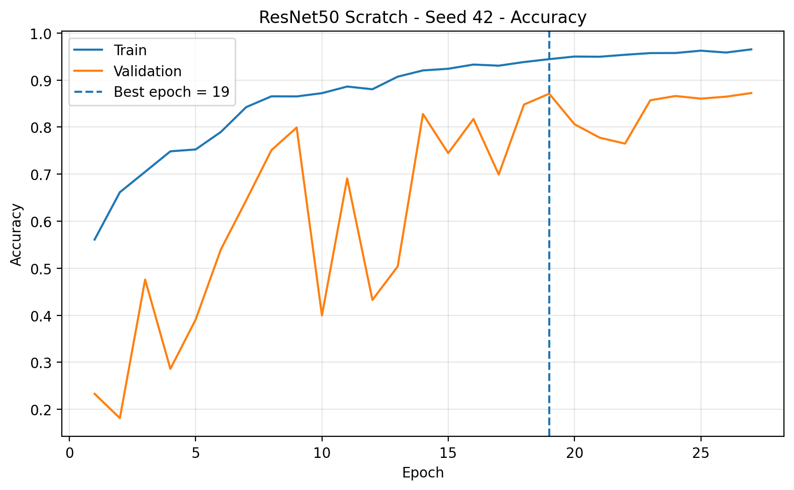
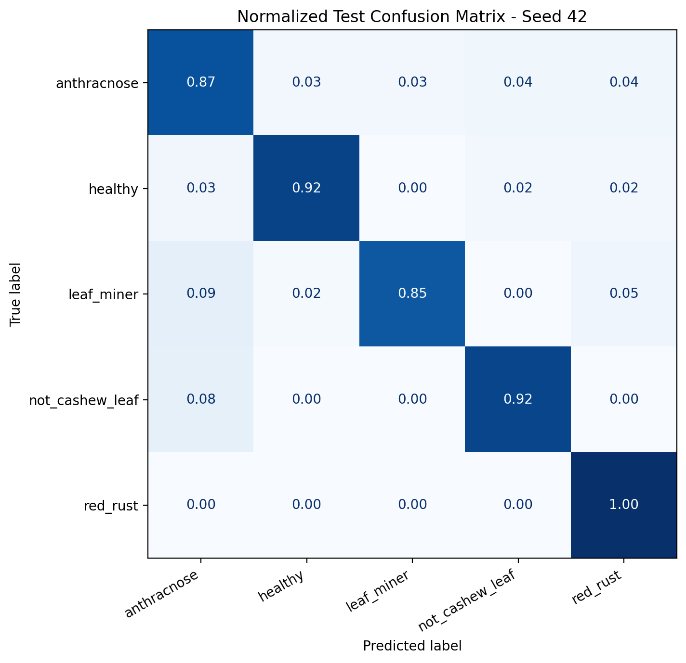
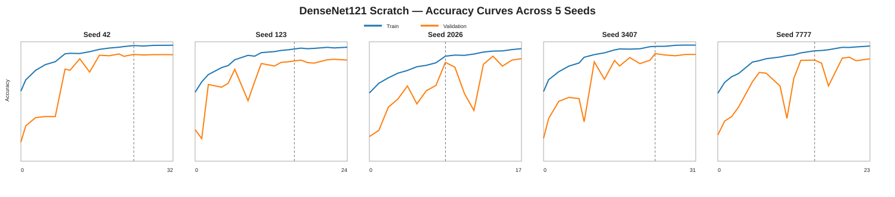

# Current Dataset Experiments

Thư mục này dành riêng cho các kết quả huấn luyện sử dụng **Master Dataset hiện tại** sau khi dataset được cập nhật. Chỉ các experiment trong thư mục này mới được xem là ứng viên cho bảng so sánh chính thức của khóa luận, trừ khi có ghi chú khác.

## Dataset hiện tại — Cashew_dataV03

Dataset classification hiện tại có **7,213 ảnh thuộc 5 lớp** và sử dụng một split cố định cho toàn bộ baseline.

| Class | Train | Validation | Test | Total |
|---|---:|---:|---:|---:|
| `anthracnose` | 1,096 | 313 | 156 | 1,565 |
| `healthy` | 818 | 225 | 128 | 1,171 |
| `leaf_miner` | 919 | 262 | 131 | 1,312 |
| `not_cashew_leaf` | 1,101 | 314 | 157 | 1,572 |
| `red_rust` | 1,115 | 319 | 159 | 1,593 |
| **TOTAL** | **5,049** | **1,433** | **731** | **7,213** |

- Tỉ lệ split xấp xỉ **70% / 20% / 10%**.
- **Test Set đã khóa** và giữ nguyên giữa các model / seed.
- File Excel mô tả phân bố dataset: [`dataset_cashew.xlsx`](../../dataset_cashew.xlsx).

## Baseline hiện tại

| Experiment | Model | Mode | Seeds | Validation Accuracy | Test Accuracy | Macro F1 | Params | Status |
|---|---|---|---:|---:|---:|---:|---:|---|
| [`EXP-RESNET50-SCRATCH-5SEEDS-002`](./EXP-RESNET50-SCRATCH-5SEEDS-002/) | ResNet50 | Scratch | 5 | **86.76 ± 0.74%** | **90.10 ± 1.82%** | **90.12 ± 1.81%** | 24.64M | ✅ Baseline hợp lệ |
| [`EXP-DENSENET121-SCRATCH-5SEEDS-002`](./EXP-DENSENET121-SCRATCH-5SEEDS-002/) | DenseNet121 | Scratch | 5 | **86.62 ± 3.04%** | **89.00 ± 3.27%** | **89.22 ± 2.92%** | **7.57M** | ✅ Baseline hợp lệ |

## So sánh nhanh

- **ResNet50** hiện mạnh hơn về Accuracy/Macro-F1 và ổn định hơn giữa các seed.
- **DenseNet121** nhẹ hơn đáng kể về số tham số nhưng biến thiên seed lớn hơn.
- `anthracnose` tiếp tục là lớp khó nhất ở cả hai baseline.
- `red_rust` là lớp ổn định nhất.

## Kết quả trực quan

### ResNet50 — representative seed 42

<table>
<tr>
<th>Training / Validation Accuracy</th>
<th>Normalized Test Confusion Matrix</th>
</tr>
<tr>
<td width="50%"></td>
<td width="50%"></td>
</tr>
</table>

### DenseNet121 — 5 seeds side-by-side

Các đường Accuracy của 5 seed được đặt trong cùng một panel để so sánh trực tiếp sự thay đổi giữa các lần chạy.

<p align="center">
  
</p>

Xem chi tiết tại [`EXP-DENSENET121-SCRATCH-5SEEDS-002/README.md`](./EXP-DENSENET121-SCRATCH-5SEEDS-002/README.md).

## YOLO26 detection experiment hiện tại

| Experiment | Model | Input | Precision | Recall | F1 | mAP50 | mAP50-95 | Status |
|---|---|---:|---:|---:|---:|---:|---:|---|
| [`EXP-Y26S-SMALL-005`](./EXP-Y26S-SMALL-005/) | YOLO26s | 640 | **0.6929** | **0.6506** | **0.6711** | **0.6609** | **0.3405** | ⚠️ Experimental — cần chuẩn hóa annotation policy |

Take 005 dùng dense small-lesion annotation. Kết quả tăng rõ so với các take cũ, nhưng chưa chọn làm final detector vì:

- Custom evaluation tại `conf=0.25`, `IoU≥0.5`: **357 TP / 246 FP / 174 FN**;
- `leaf_miner` chỉ chiếm khoảng **3.7%** số box Train;
- `red_rust` chiếm khoảng **64.5%** box Train;
- toàn bộ ảnh detection hiện đều có box, chưa có negative images rõ ràng;
- annotation giữa Anthracnose và Red Rust chưa có cùng mức độ exhaustive.

Xem phân tích chi tiết tại [`EXP-Y26S-SMALL-005/README.md`](./EXP-Y26S-SMALL-005/README.md).

## Protocol đánh giá

- Cùng một Train / Validation / Test split cho tất cả seed.
- Mỗi configuration chạy trên 5 seed: `42, 123, 2026, 3407, 7777`.
- Validation dùng cho checkpoint, EarlyStopping, learning-rate scheduling và lựa chọn deployment seed.
- Test Set không dùng để tuning hoặc chọn seed tốt nhất.
- Báo cáo kết quả theo **Mean ± sample Standard Deviation (ddof=1)**.
- Với YOLO, threshold vận hành cuối phải được chọn trên Validation rồi khóa trước khi đánh giá Test.

## Quy tắc lưu experiment

Mỗi experiment nên có cấu trúc tối thiểu:

```text
EXP-{MODEL}-{MODE}-{NO}/
├── README.md
├── experiment_config.json
├── aggregate/
└── figures / per-seed artifacts
```

Không sử dụng kết quả trong `../archive_legacy_dataset/` để so sánh trực tiếp với các experiment mới vì chúng được huấn luyện trên dataset cũ.

## Lưu ý dung lượng

Checkpoint `.weights.h5`, `.keras`, `.pt` và full ZIP dung lượng lớn không commit trực tiếp vào GitHub. Repo ưu tiên lưu config, metrics, CSV và figures. FULL archive được giữ riêng để phục vụ tái sử dụng model và kết hợp YOLO sau này.
