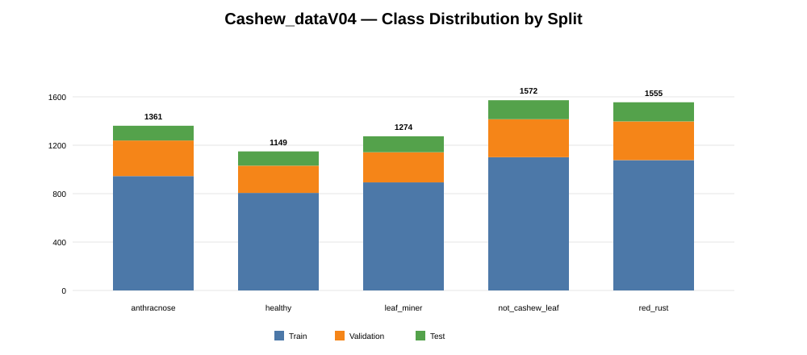
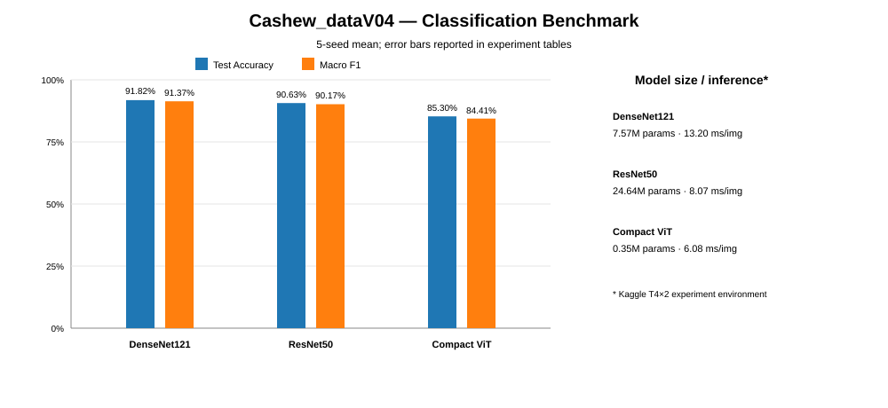

# Current Dataset Experiments — Cashew_dataV04

Thư mục này quản lý các **classification baseline chính thức** trên Master Dataset hiện tại `Cashew_dataV04`.

## Dataset snapshot

V04 được tạo sau lần làm sạch bổ sung: loại ảnh mờ/chất lượng thấp và xử lý các trường hợp có nguy cơ **data leakage** giữa các split.

| Class | Train | Validation | Test | Total |
|---|---:|---:|---:|---:|
| `anthracnose` | 945 | 294 | 122 | 1,361 |
| `healthy` | 806 | 225 | 118 | 1,149 |
| `leaf_miner` | 893 | 249 | 132 | 1,274 |
| `not_cashew_leaf` | 1,101 | 314 | 157 | 1,572 |
| `red_rust` | 1,077 | 320 | 158 | 1,555 |
| **TOTAL** | **4,822** | **1,402** | **687** | **6,911** |

## Benchmark V04

| Experiment | Model | Val Accuracy | Test Accuracy | Macro F1 | Params | Inference* |
|---|---|---:|---:|---:|---:|---:|
| [`EXP-DENSENET121-SCRATCH-5SEEDS-003`](./EXP-DENSENET121-SCRATCH-5SEEDS-003/) | DenseNet121 | **89.87 ± 1.85%** | **91.82 ± 0.86%** | **91.37 ± 0.79%** | 7.57M | 13.20 ms/img |
| [`EXP-RESNET50-SCRATCH-5SEEDS-003`](./EXP-RESNET50-SCRATCH-5SEEDS-003/) | ResNet50 | **88.22 ± 2.49%** | **90.63 ± 2.11%** | **90.17 ± 2.04%** | 24.64M | 8.07 ms/img |
| [`EXP-VIT-SCRATCH-5SEEDS-003`](./EXP-VIT-SCRATCH-5SEEDS-003/) | Compact ViT | **85.28 ± 1.28%** | **85.30 ± 1.68%** | **84.41 ± 1.71%** | **0.35M** | **6.08 ms/img** |

\* Inference benchmark được đo trong môi trường Kaggle T4×2/MirroredStrategy của từng experiment; không xem là tốc độ deployment trên web/mobile.

### Latest validation rerun — DenseNet121 EXP-004

[`EXP-DENSENET121-SCRATCH-5SEEDS-004`](./EXP-DENSENET121-SCRATCH-5SEEDS-004/) là rerun mới nhất của DenseNet121 trên V04, chạy single-GPU `OneDeviceStrategy`. Archive gốc vô tình tái sử dụng ID `...-003`; repository đổi thành `...-004` để không ghi đè official experiment cũ.

| Metric | Official EXP-003 | Rerun EXP-004 | Change |
|---|---:|---:|---:|
| Validation Accuracy | 89.87 ± 1.85% | **92.13 ± 1.31%** | +2.26 pp mean |
| Validation Macro F1 | 89.53 ± 1.96% | **91.90 ± 1.37%** | +2.37 pp mean |

Per-class Validation F1 của DenseNet121 EXP-004:

| Class | F1 ± SD |
|---|---:|
| `anthracnose` | **86.47 ± 2.66%** |
| `healthy` | **90.54 ± 2.45%** |
| `leaf_miner` | **90.94 ± 1.36%** |
| `not_cashew_leaf` | **94.18 ± 0.71%** |
| `red_rust` | **97.39 ± 0.35%** |

Cả 5 seed đều có Validation Accuracy và Macro-F1 cao hơn lần chạy EXP-003 trước. Seed `42` có Validation Macro-F1 cao nhất (**93.11%**) và là candidate checkpoint theo rule Validation-only hiện tại.

> DenseNet121 EXP-004 **chưa thay thế** official EXP-003 trong Test benchmark vì archive mới có `run_final_test=false`. Cần freeze checkpoint và chạy locked Test trên cả 5 seed trước khi cập nhật `benchmark_v04.csv`.

Chi tiết: [`EXP-DENSENET121-SCRATCH-5SEEDS-004/ANALYSIS.md`](./EXP-DENSENET121-SCRATCH-5SEEDS-004/ANALYSIS.md)

### Latest validation rerun — ResNet50 EXP-004

[`EXP-RESNET50-SCRATCH-5SEEDS-004`](./EXP-RESNET50-SCRATCH-5SEEDS-004/) là lần chạy mới nhất trên **Google Colab / NVIDIA L4 / OneDeviceStrategy**. Experiment đã hoàn thành training + validation cho 5 seed nhưng **chưa chạy locked Test**.

| Metric | EXP-003 | EXP-004 | Change |
|---|---:|---:|---:|
| Validation Accuracy | 88.22 ± 2.49% | **90.23 ± 1.45%** | +2.01 pp mean |
| Validation Macro F1 | 88.06 ± 2.52% | **90.03 ± 1.44%** | +1.97 pp mean |

Per-class Validation F1 của EXP-004:

| Class | F1 ± SD |
|---|---:|
| `anthracnose` | **83.46 ± 2.87%** |
| `healthy` | **89.38 ± 2.83%** |
| `leaf_miner` | **89.55 ± 0.95%** |
| `not_cashew_leaf` | **92.28 ± 2.35%** |
| `red_rust` | **95.50 ± 0.95%** |

`anthracnose` tiếp tục là class khó nhất. Seed `7777` có Validation Macro-F1 cao nhất (**91.59%**) và hiện là candidate checkpoint nếu selection rule vẫn là Validation Macro-F1.

> ResNet50 EXP-004 **chưa thay thế** EXP-003 trong official Test benchmark. Cần giữ nguyên 5 checkpoint hiện tại, chạy Test khóa trên cả 5 seed và chỉ sau đó mới cập nhật `benchmark_v04.csv`.

Chi tiết: [`EXP-RESNET50-SCRATCH-5SEEDS-004/ANALYSIS.md`](./EXP-RESNET50-SCRATCH-5SEEDS-004/ANALYSIS.md)

### Kết luận benchmark hiện tại

- **DenseNet121 EXP-003** vẫn có official Test performance tổng thể cao nhất và Test Accuracy Std thấp nhất (**0.86%**); EXP-004 có validation mạnh/ổn định hơn nhưng Test còn pending.
- **ResNet50 EXP-003** vẫn là official Test row cho ResNet50; EXP-004 mới chỉ hoàn thành validation.
- **Compact ViT** nhẹ nhất rõ rệt và nhanh nhất trong benchmark GPU hiện tại, nhưng hiệu năng thấp hơn hai CNN.
- `anthracnose` tiếp tục là lớp khó nhất ở các kiến trúc classification hiện tại.

## Per-class Macro comparison — official Test benchmark

| Class | DenseNet121 F1 | ResNet50 F1 | ViT F1 |
|---|---:|---:|---:|
| `anthracnose` | 81.30 ± 2.00% | 79.35 ± 3.84% | 70.43 ± 4.44% |
| `healthy` | 91.68 ± 1.51% | 90.69 ± 2.05% | 79.72 ± 2.22% |
| `leaf_miner` | 91.29 ± 1.37% | 90.75 ± 1.06% | 84.81 ± 2.45% |
| `not_cashew_leaf` | 96.02 ± 1.35% | 94.06 ± 2.48% | 97.28 ± 1.37% |
| `red_rust` | 96.58 ± 0.42% | 95.99 ± 1.56% | 89.81 ± 1.90% |

## Protocol

- Fixed split trong toàn bộ `Cashew_dataV04`.
- Seeds: `42, 123, 2026, 3407, 7777`.
- Validation dùng cho checkpoint, EarlyStopping/LR scheduling và deployment-seed selection.
- Test Set không dùng để tuning hoặc chọn seed.
- Kết quả báo cáo theo **Mean ± sample Standard Deviation (`ddof=1`)**.
- Các figure so sánh seed phải dùng panel chung để tránh chọn hình đẹp nhất.
- Validation-only rerun không được thay thế official Test benchmark cho tới khi final Test được chạy đúng protocol.
- Không ghi đè experiment cũ; ID trùng phải được version hóa thành experiment mới.

## Machine-readable summaries

- [`benchmark_v04.csv`](./benchmark_v04.csv)
- [`class_f1_comparison_v04.csv`](./class_f1_comparison_v04.csv)
- [`dataset_cashew_v04.csv`](../../dataset_cashew_v04.csv)
- [`EXP-DENSENET121-SCRATCH-5SEEDS-004/aggregate/validation_mean_std_summary.csv`](./EXP-DENSENET121-SCRATCH-5SEEDS-004/aggregate/validation_mean_std_summary.csv)
- [`EXP-RESNET50-SCRATCH-5SEEDS-004/aggregate/validation_mean_std_summary.csv`](./EXP-RESNET50-SCRATCH-5SEEDS-004/aggregate/validation_mean_std_summary.csv)

## Dataset versioning

Các experiment `*-002` dùng `Cashew_dataV03` vẫn còn trong thư mục này để giữ tương thích với các đường dẫn cũ, nhưng **không còn là current benchmark**. Không so sánh trực tiếp V03 với V04 như một controlled model comparison vì Train/Validation/Test đã thay đổi.

Các experiment rất cũ hơn nữa được lưu tại [`../archive_legacy_dataset/`](../archive_legacy_dataset/).

## Object detection

Các YOLO26 take đang ở giai đoạn annotation/data iteration được quản lý riêng tại [`../../failure/YOLO26/README.md`](../../failure/YOLO26/README.md). Take 006 là iteration tốt nhất hiện tại nhưng chưa được khóa làm final detector.
